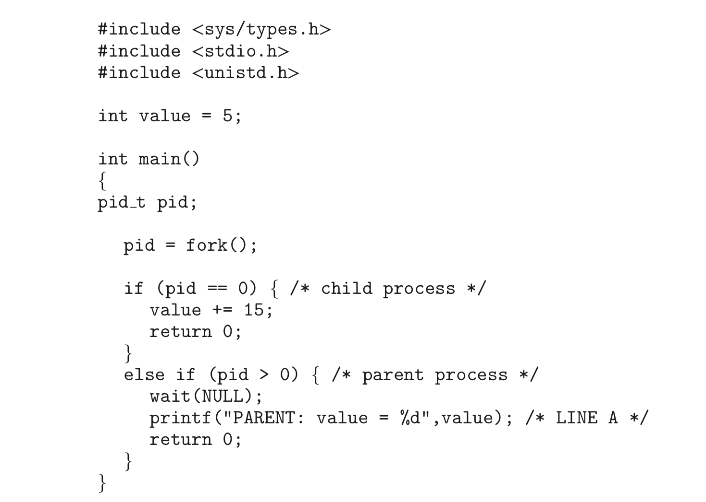
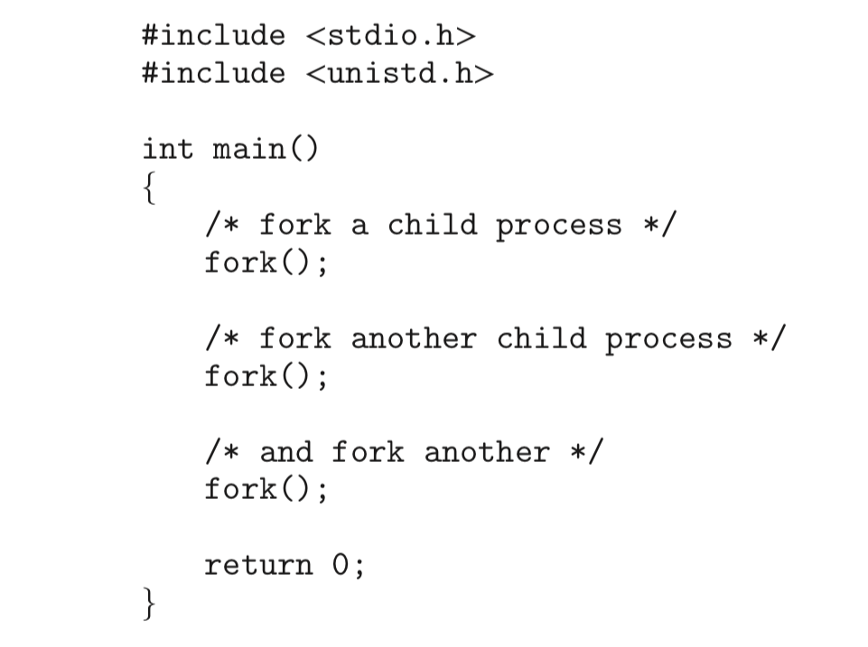

# Homework 3
余北辰 519030910245

**3.1 Using the program shown in Figure 3.30, explain what the output will be at LINE A.**

输出的答案将会是：`PARENT: value = 5`
子进程与父进程的一个副本，这两个副本不会互相影响，子进程中value = 15，而父进程中仍为5。

**3.2 Including the initial parent process, how many processes are created by the program shown in Figure 3.31?**

8个。
每调用一次fork()函数，每一个进程创建出一个子进程，即进程的数量乘2。调用3次，则一共8个子进程。

**3.4 Some computer systems provide multiple register sets. Describe what happens when a context switch occurs if the new context is already loaded into one of the register sets. What happens if the new context is in memory rather than in a register set and all the register sets are in use?**

如果新的上下文已经读取到一个寄存器组中，那么上下文切换的时候只需要简单的切换当前寄存器组的指针；如果所有的寄存器组都处于繁忙状态、新的上下文存储在内存中，那么上下文切换的时候就需要在寄存器和内存间进行数据复制。
（参考《操作系统概念中文翻译版（原书第9版）》 第78页）

**3.8 Describe the actions taken by a kernel to context-switch between processes.**

先执行状态保存，将当前的进程的CPU运行状态以PCB的形式保存下来；在执行状态恢复，读取新的上下文的PCB并恢复运行。
（参考《操作系统概念中文翻译版（原书第9版）》 第78页）

**3.10 Explain the role of the init (or systemd) process on UNIX and Linux systems in regard to process termination.**

init进程作为孤儿进程的父进程，定期调用wait()以收集孤儿进程的退出状态，并释放孤儿进程的标识符和进程表条目。
（参考《操作系统概念中文翻译版（原书第9版）》 第83页）
