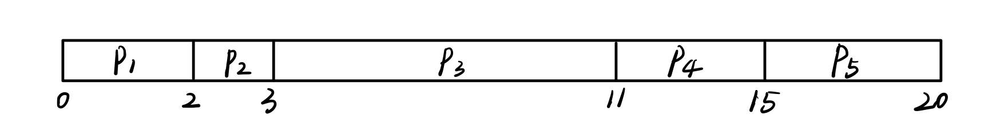
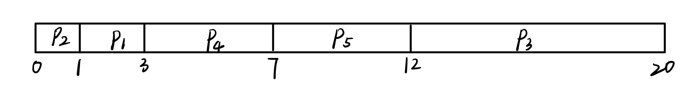
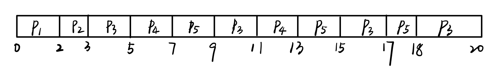
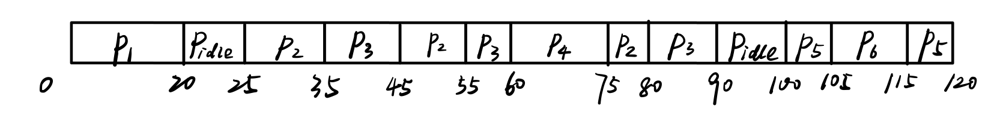
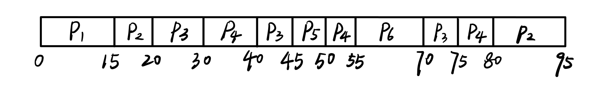

# Homework 5

余北辰 519030910245

**5.4 Consider the following set of processes, with the length of the CPU burst time given in milliseconds:**

| Process | Burst Time | Priority |
| :-----: | :--------: | :------: |
|  $P_1$  |     2      |    2     |
|  $P_2$  |     1      |    1     |
|  $P_3$  |     8      |    4     |
|  $P_4$  |     4      |    2     |
|  $P_5$  |     5      |    3     |

**The processes are assumed to have arrived in the order $P_1 , P_2 , P_3 , P_4 , P_5$ , all at time 0.**

**a. 	Draw four Gantt charts that illustrate the execution of these processes using the following scheduling algorithms: FCFS, SJF, non-preemptive priority (a larger priority number implies a higher priority), and RR (quantum = 2).**

**b.	 What is the turnaround time of each process for each of the scheduling algorithms in part a?**

**c.	 What is the waiting time of each process for each of these scheduling algorithms?**

**d.	 Which of the algorithms results in the minimum average waiting time (over all processes)?**

a.

FCFS: 

SJF:

non-preemptive priority：

RR:

b.  

| turnaround time         | $P_1$ | $P_2$ | $P_3$ | $P_4$ | $P_5$ |
| ----------------------- | ----- | ----- | ----- | ----- | ----- |
| FCFS                    | 2     | 3     | 11    | 15    | 20    |
| SJF                     | 3     | 1     | 20    | 7     | 12    |
| non-preemptive priority | 15    | 20    | 8     | 19    | 13    |
| RR                      | 2     | 3     | 20    | 13    | 18    |

C.

| waiting time            | $P_1$ | $P_2$ | $P_3$ | $P_4$ | $P_5$ |
| ----------------------- | ----- | ----- | ----- | ----- | ----- |
| FCFS                    | 0     | 2     | 3     | 11    | 15    |
| SJF                     | 1     | 0     | 12    | 3     | 7     |
| non-preemptive priority | 13    | 19    | 0     | 15    | 8     |
| RR                      | 0     | 2     | 12    | 9     | 13    |

d.

FCFS各进程的平均waiting time为$(0+2+3+11+15)/5 = 6.2$；

SJF各进程的平均waiting time为$(1+0+12+3+7)/5 = 4.6$；

non-preemptive priority各进程的平均waiting time为$(13+19+0+15+8)/5 = 11$；

RR各进程的平均waiting time为$(0+2+12+9+13)/5 = 7.2$；

因此SJF和non-preemptive priority各进程的平均waiting time最短。

---

**5.5 The following processes are being scheduled using a preemptive, round-robin scheduling algorithm.**

| Process | Priority | Burst | Arrival |
| :-----: | :------: | :---: | :-----: |
|  $P_1$  |    40    |  20   |    0    |
|  $P_2$  |    30    |  25   |   25    |
|  $P_3$  |    30    |  25   |   30    |
|  $P_4$  |    35    |  15   |   60    |
|  $P_5$  |    5     |  10   |   100   |
|  $P_6$  |    10    |  10   |   105   |

**Each process is assigned a numerical priority, with a higher number indicating a higher relative priority. In addition to the processes listed below, the system also has an idle task (which consumes no CPU resources and is identified as $P_{idle}$ ). This task has priority 0 and is scheduled whenever the system has no other available processes to run. The length of a Practice Exercises time quantum is 10 units. If a process is preempted by a higher-priority process, the preempted process is placed at the end of the queue.**

**a.	 Show the scheduling order of the processes using a Gantt chart.**

**b.	 What is the turnaround time for each process?**

**c.	 What is the waiting time for each process?**

**d.	 What is the CPU utilization rate?**

a.  Gantt图如下：

b.  各进程的turnaround time见下表：

| $P_1$ | $P_2$    | $P_3$    | $P_4$    | $P_5$      | $P_6$      |
| ----- | -------- | -------- | -------- | ---------- | ---------- |
| 20    | 80-25=55 | 90-30=60 | 75-60=15 | 120-100=20 | 115-105=10 |

c.  各进程的waiting time见下表：

| $P_1$ | $P_2$    | $P_3$      | $P_4$ | $P_5$ | $P_6$ |
| ----- | -------- | ---------- | ----- | ----- | ----- |
| 0     | 10+20=30 | 5+10+20=35 | 0     | 10    | 0     |

d.  CPU利用率为：

$$
\frac{120-5-10}{120} \times 100\% = 87.5\%
$$

---

**5.10 The traditional UNIX scheduler enforces an inverse relationship between priority numbers and priorities: the higher the number, the lower the priority. The scheduler recalculates process priorities once per second using the following function:**

**Priority = (recent CPU usage / 2) + base**

**where base = 60 and recent CPU usage refers to a value indicating how often a process has used the CPU since priorities were last recalculated.**

**Assume that recent CPU usage for process $P_1$ is 40, for process $P_2$ is 18, and for process $P_3$ is 10. What will be the new priorities for these three processes when priorities are recalculated? Based on this information, does the traditional UNIX scheduler raise or lower the relative priority of a CPU-bound process?**

Priority($P_1$) = 40/2 + 60 = 80；

Priority($P_2$) = 18/2 + 60 = 69；

Priority($P_3$) = 10/2 + 60 = 65；

通过将CPU usage的值减半后加上了基数，实际上减少了CPU usage在计算priority时的权重，降低了CPU-bound进程的相对优先级。

---

**5.18 The following processes are being scheduled using a preemptive, priority-based, round-robin scheduling algorithm.**

| Process | Priority | Burst | Arrival |
| :-----: | :------: | ----- | ------- |
|  $P_1$  |    8     | 15    | 0       |
|  $P_2$  |    3     | 20    | 0       |
|  $P_3$  |    4     | 20    | 20      |
|  $P_4$  |    4     | 20    | 25      |
|  $P_5$  |    5     | 5     | 45      |
|  $P_6$  |    5     | 15    | 55      |

**Each process is assigned a numerical priority, with a higher number indicating a higher relative priority. The scheduler will execute the highest priority process. For processes with the same priority, a round-robin scheduler will be used with a time quantum of 10 units. If a process is preempted by a higher-priority process, the preempted process is placed at the end of the queue.**

**a.	 Show the scheduling order of the processes using a Gantt chart.**

**b.	 What is the turnaround time for each process?**

**c. 	What is the waiting time for each process?**

a.

b.  各进程的turnaround time见下表：

| $P_1$ | $P_2$ | $P_3$    | $P_4$    | $P_5$   | $P_6$    |
| ----- | ----- | -------- | -------- | ------- | -------- |
| 15    | 95    | 75-20=55 | 80-25=55 | 50-45=5 | 70-55=15 |

c.  各进程的waiting time见下表：

| $P_1$ | $P_2$    | $P_3$    | $P_4$      | $P_5$ | $P_6$ |
| ----- | -------- | -------- | ---------- | ----- | ----- |
| 0     | 15+60=75 | 10+25=35 | 5+10+20=35 | 0     | 0     |

---

**5.20 Which of the following scheduling algorithms could result in starvation?**

**a. 	First-come, first-served**

**b.	 Shortest job first**

**c.	 Round robin**

**d.	 Priority**

b,d 可能会导致进程饿死，因为可能会不断有更短的或优先级更高的进程加入，导致进程一直无法执行。

