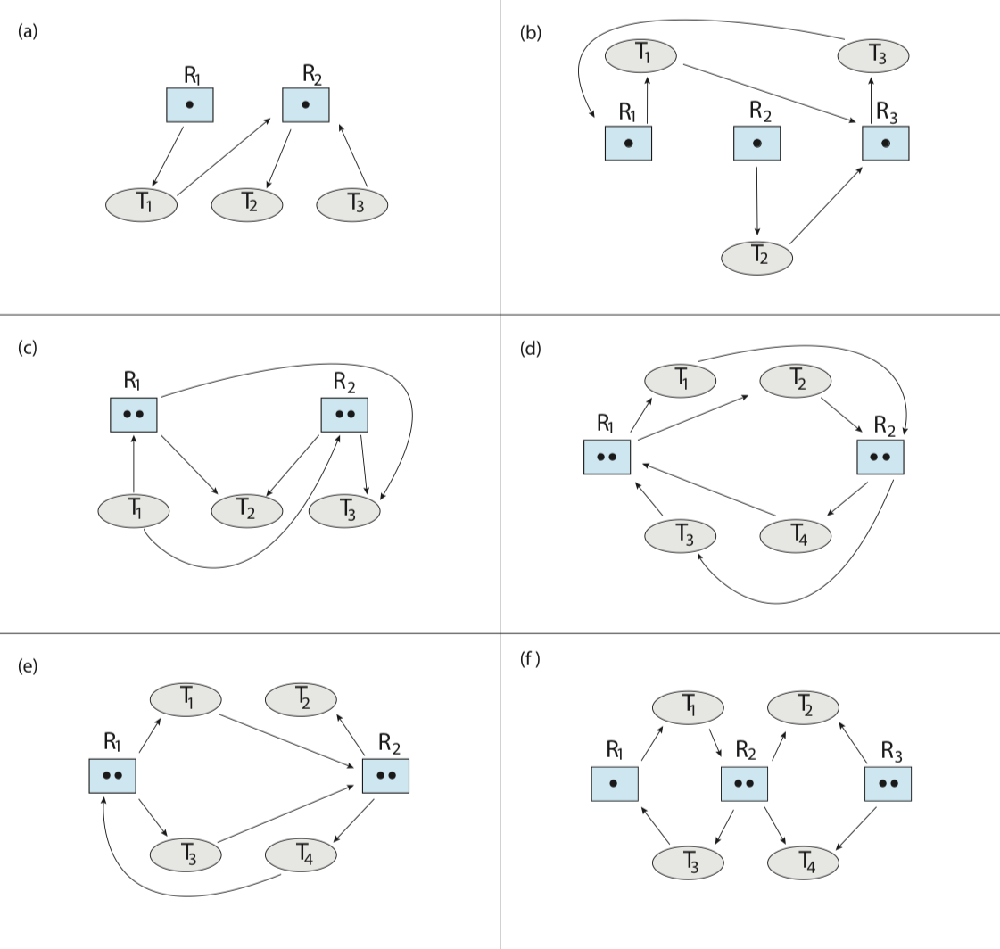

# Homework 8

余北辰 519030910245

**8.3 Consider the following snapshot of a system:**

|       |    Allocation    |       Max        |    Available     |
| :---: | :--------------: | :--------------: | :--------------: |
|       | A    B    C    D | A    B    C    D | A    B    C    D |
| $T_0$ | 0    0    1    2 | 0    0    1    2 | 1    5    2    0 |
| $T_1$ | 1    0    0    0 | 1    7    5    0 |                  |
| $T_2$ | 1    3    5    4 | 2    3    5    6 |                  |
| $T_3$ | 0    6    3    2 | 0    6    5    2 |                  |
| $T_4$ | 0    0    1    4 | 0    6    5    6 |                  |

**Answer the following questions using the banker’s algorithm:**

**a. What is the content of the matrix *Need*?**

**b. Is the system in a safe state?**

**c. If a request from thread $T_{1}$ arrives for $(0,4,2,0)$, can the request be granted immediately?**

---

**8.9 Consider the following snapshot of a system:**

|       |    Allocation    |       Max        |
| :---: | :--------------: | :--------------: |
|       | A    B    C    D | A    B    C    D |
| $T_0$ | 3    0    1    4 | 5    1    1    7 |
| $T_1$ | 2    2    1    0 | 3    2    1    1 |
| $T_2$ | 3    1    2    1 | 3    3    2    1 |
| $T_3$ | 0    5    1    0 | 4    6    1    2 |
| $T_4$ | 4    2    1    2 | 6    3    2    5 |

**Using the banker’s algorithm, determine whether or not each of the following states is unsafe. If the state is safe, illustrate the order in which the threads may complete. Otherwise, illustrate why the state is unsafe.**

**a. Available = $(0, 3, 0, 1)$**

**b. Available = $(1, 0, 0, 2)$**

---

**8.18 Which of the six resource-allocation graphs shown in Figure 8.12 illustrate deadlock? For those situations that are deadlocked, provide the cycle of threads and resources. Where there is not a deadlock situation, illustrate the order in which the threads may complete execution.**

---

**8.27 Consider the following snapshot of a system:**

|       |    Allocation    |       Max        |
| :---: | :--------------: | :--------------: |
|       | A    B    C    D | A    B    C    D |
| $T_0$ | 1    2    0    2 | 4    3    1    6 |
| $T_1$ | 0    1    1    2 | 2    4    2    4 |
| $T_2$ | 1    2    4    0 | 3    6    5    1 |
| $T_3$ | 1    2    0    1 | 2    6    2    3 |
| $T_4$ | 1    0    0    1 | 3    1    1    2 |

**Using the banker’s algorithm, determine whether or not each of the following states is unsafe. If the state is safe, illustrate the order in which the threads may complete. Otherwise, illustrate why the state is unsafe.**

**a. Available = $(2, 2, 2, 3)$**

**b. Available = $(4, 4, 1, 1)$**

**c. Available = $(3, 0, 1, 4)$**

**d. Available = $(1, 5, 2, 2)$**

---

**8.28 Consider the following snapshot of a system:**

|       |    Allocation    |       Max        |    Available     |
| :---: | :--------------: | :--------------: | :--------------: |
|       | A    B    C    D | A    B    C    D | A    B    C    D |
| $T_0$ | 3    1    4    1 | 6    4    7    3 | 2    2    2    4 |
| $T_1$ | 2    1    0    2 | 4    2    3    2 |                  |
| $T_2$ | 2    1    4    3 | 2    5    3    3 |                  |
| $T_3$ | 4    1    1    0 | 6    3    3    2 |                  |
| $T_4$ | 2    2    2    1 | 5    6    7    5 |                  |

**Answer the following questions using the banker’s algorithm:**

**a. Illustrate that the system is in a safe state by demonstrating an order in which the threads may complete.**

**b. If a request from thread $T_4$ arrives for $(2, 2, 2, 4)$, can the request be granted immediately?**

**c. If a request from thread $T_2$ arrives for $(0, 1, 1, 0)$, can the request be granted immediately?**

**d. If a request from thread $T_3$ arrives for $(2, 2, 1, 2)$, can the request be granted immediately**