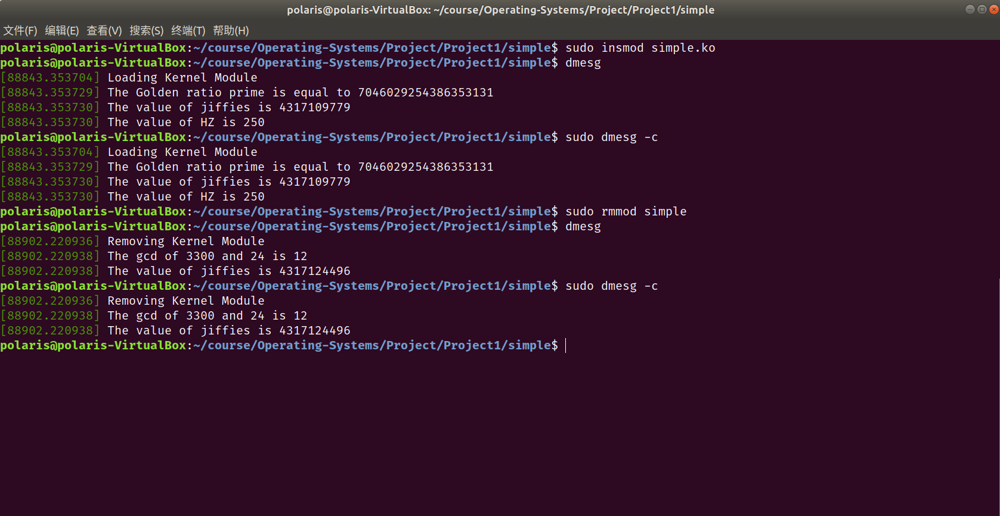
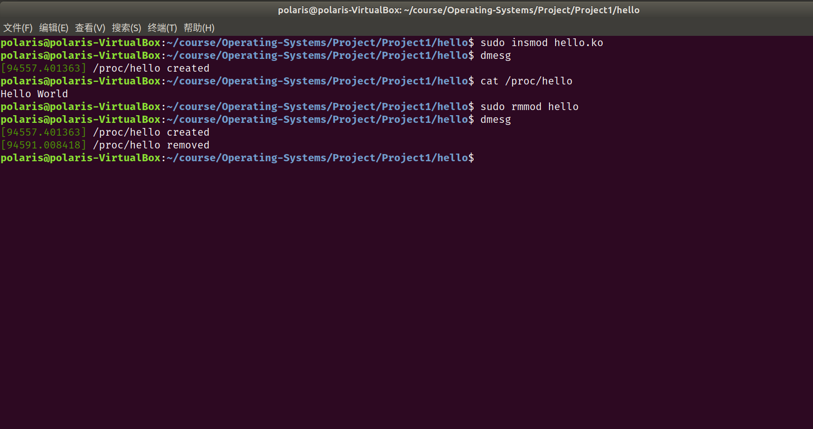
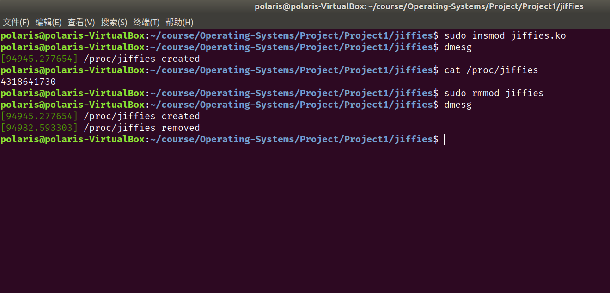
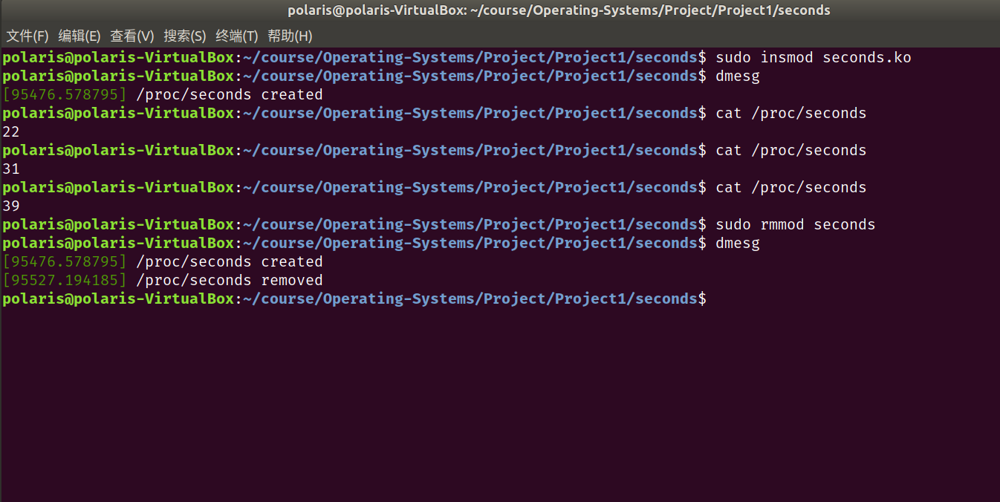

# Project1 实验报告

 余北辰 519030910245


## 1 实验概述

### 1.1 实验名称
Introduction to Linux Kernel Modules

### 1.2 实验内容

1. 创建simple模块，实现模块的加载与卸载
2. 创建hello模块，实现在/proc文件系统读写信息
3. 创建jiffies模块，获取jiffies的值
4. 创建seconds模块，通过简单计算，获取首次加载模块后经过的秒数

## 2 实验环境

- Ubuntu 18.04.5 LTS
- Linux version 5.4.0-72-generic
- VirtualBox 6.1.18

## 3 实验过程与结果展示

### 3.1 simple模块

该部分的要求为：

1. Print out the value of `GOLDEN RATIO PRIME` in the simple `init()` function.
2. Print out the greatest common divisor of 3,300 and 24 in the simple `exit()` function.
3. Print out the values of `jiffies` and `HZ` in the simple `init()` function. 
4. Print out the value of jiffies in the simple `exit()` function.

`simple_init()`函数如下：

```c
int simple_init(void)
{
       printk(KERN_INFO "Loading Kernel Module\n");
       printk(KERN_INFO "The Golden ratio prime is equal to %lu\n", GOLDEN_RATIO_PRIME);
       printk(KERN_INFO "The value of jiffies is %lu\n", jiffies);
       printk(KERN_INFO "The value of HZ is %lu\n", HZ);
       return 0;
}
```

`simple_exit()`函数如下：

```c
void simple_exit(void)
{
       printk(KERN_INFO "Removing Kernel Module\n");
       printk(KERN_INFO "The gcd of 3300 and 24 is %lu\n", gcd(3300, 24));
       printk(KERN_INFO "The value of jiffies is %lu\n", jiffies);
}
```

注意因为涉及到`jiffies`的计算和最大公约数的运算，需要`#include <linux/gcd.h>`以及`#include <linux/jiffies.h>`。

使用`sudo insmod simple.ko`命令，加载simple模块；

使用`sudo rmmod simple`命令，移除simple模块；

使用`dmesg`命令，检查内核日志缓冲区的信息；

运行结果如下所示：



### 3.2 hello模块

该部分非实验作业内容，而是属于实验的教学部分。

该部分的要求为：create a new entry in the /proc file system. If a user enters the command `cat /proc/hello`, the infamous `Hello World` message is returned.

`proc_init()`与`proc_exit()`代码如下：

```c
int proc_init(void)
{
        proc_create(PROC_NAME, 0, NULL, &proc_ops);

        printk(KERN_INFO "/proc/%s created\n", PROC_NAME);

	return 0;
}

void proc_exit(void) {

        remove_proc_entry(PROC_NAME, NULL);

        printk( KERN_INFO "/proc/%s removed\n", PROC_NAME);
}

```

`proc_read()`代码如下:

```c
ssize_t proc_read(struct file *file, char __user *usr_buf, size_t count, loff_t *pos)
{
        int rv = 0;
        char buffer[BUFFER_SIZE];
        static int completed = 0;

        if (completed) {
                completed = 0;
                return 0;
        }

        completed = 1;

        rv = sprintf(buffer, "Hello World\n");

        // copies the contents of buffer to userspace usr_buf
        copy_to_user(usr_buf, buffer, rv);

        return rv;
}


```

运行结果如下：



### 3.3 jiffies模块

该部分的要求为：

creates a /proc file named /proc/jiffies that reports the current value of jiffies when the /proc/jiffies file is read

这与hello模块类似，`proc_init()`与`proc_exit()`代码与hello模块中相同。

对hello模块中的`proc_read()`函数进行修改，使其读取jiffies的值：

```c
ssize_t proc_read(struct file *file, char __user *usr_buf, size_t count, loff_t *pos)
{
        int rv = 0;
        char buffer[BUFFER_SIZE];
        static int completed = 0;

        if (completed) {
                completed = 0;
                return 0;
        }

        completed = 1;

        rv = sprintf(buffer, "%lu\n", jiffies);

        // copies the contents of buffer to userspace usr_buf
        copy_to_user(usr_buf, buffer, rv);

        return rv;
}
```

运行结果如下：



### 3.4 seconds模块

该部分的要求为：

creates a proc file named /proc/seconds that reports the number of elapsed seconds since the kernel module was loaded.

根据提示，我们知道用jiffies之差除以HZ就是所求的秒数了。

`proc_init()`实现的时候，用变量 $T_0$ 记录当前jiffies值：

```c
int proc_init(void)
{
        proc_create(PROC_NAME, 0, NULL, &proc_ops);
        T0 = jiffies;
        printk(KERN_INFO "/proc/%s created\n", PROC_NAME);

        return 0;
}
```

 的`proc_exit()`代码与hello模块中相同。

对hello模块中的`proc_read()`函数进行修改：

```c
ssize_t proc_read(struct file *file, char __user *usr_buf, size_t count, loff_t *pos)
{
        int rv = 0;
        char buffer[BUFFER_SIZE];
        static int completed = 0;

        if (completed)
        {
                completed = 0;
                return 0;
        }

        completed = 1;

        rv = sprintf(buffer, "%lu\n", (jiffies - T0) / HZ);

        // copies the contents of buffer to userspace usr_buf
        copy_to_user(usr_buf, buffer, rv);

        return rv;
}
```

运行结果如下：



## 4 实验总结

1. 经过学习网上的资料，成功安装虚拟机并配置好实验所需的linux环境
2. 本次实验较为顺利，没有碰到太多的难点
3. 以此次实验为契机，学习了一些基本的命令行操作
4. 以此次实验为契机，学习了Makefile文件的编写

## 5 实验参考资料

* 实验参考书籍：Operating System Concept，$10^{th}$ edition
* 实验源代码网址：https://github.com/greggagne/osc10e