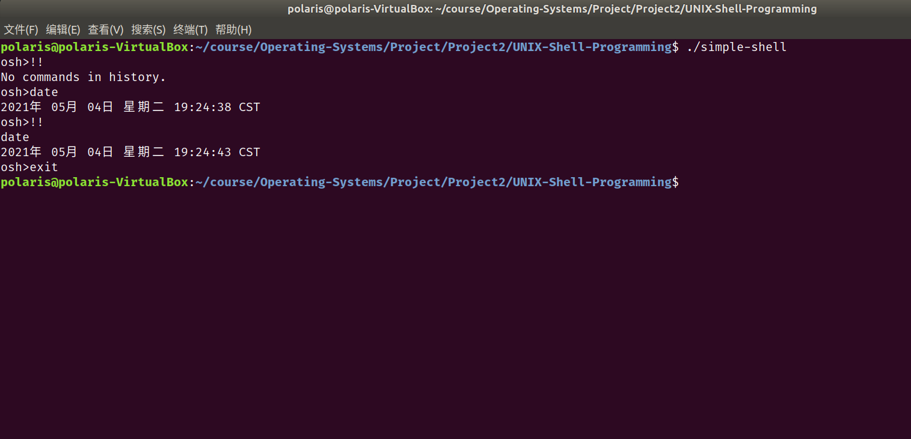
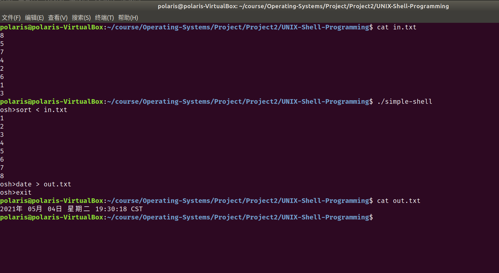
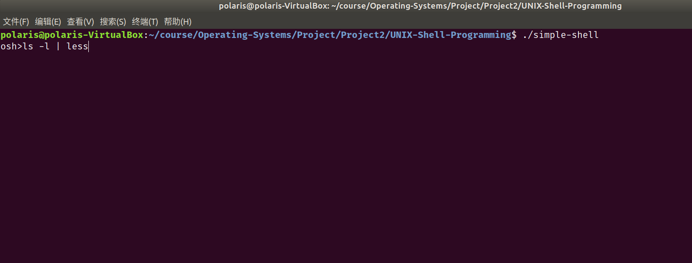
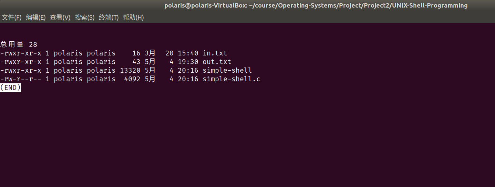
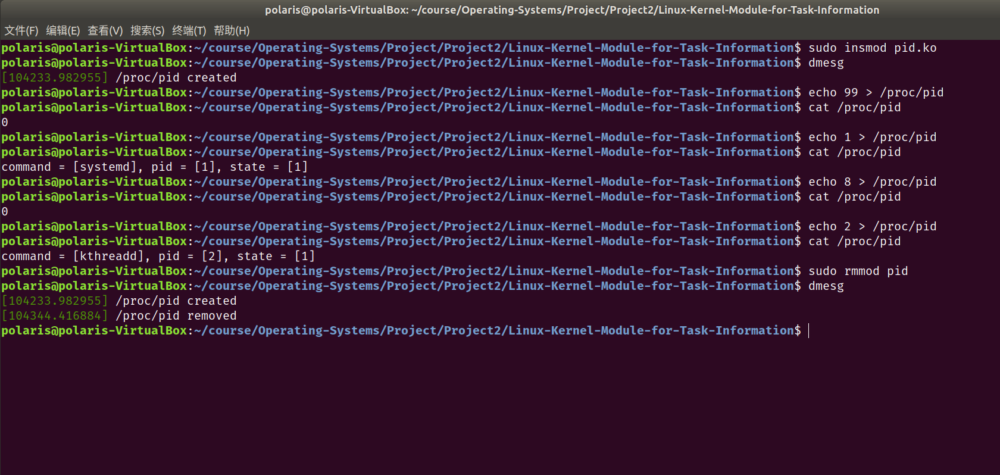

# Project2 实验报告

 余北辰 519030910245


## 1 实验概述

### 1.1 实验名称
UNIX Shell Programming & Linux Kernel Module for Task Information

### 1.2 实验内容

1. 实现简单的Unix shell，完成shell的一些基本的功能
2. 编写一个Linux Kernel Module，根据输入的pid输出对应进程的命令、pid和进程状态

## 2 实验环境

- Ubuntu 18.04.5 LTS
- Linux version 5.4.0-72-generic
- VirtualBox 6.1.18

## 3 实验过程与结果展示

### 3.1 UNIX Shell Programming

基本思路：使用一个while循环，不断读取用户的命令，并判断用户的命令是否是含有`exit`、`!!`、`&`、`|`、`>`、`<`这些特殊命令。先根据读取的特殊命令进行特殊化处理，再调用`execvp()`函数；

#### 参数的声明和初始化

首先对各参数进行声明：

```c
	#define MAX_LINE 80 /* 80 chars per line, per command */

	pid_t pid;
	pid_t pipe_pid;
	int parent_wait;
	int history_exist = 0;
	int num_of_args;
	int history_num_of_args;
	char *args[MAX_LINE / 2 + 1]; /* command line (of 80) has max of 40 arguments */
	char history_args[MAX_LINE / 2 + 1][MAX_LINE / 2 + 1];
	char *pipe_args[MAX_LINE / 2 + 1];
	int should_run = 1;
	int input_red, output_red;
	int pipe_created;
	int num_of_pipe_args;
	int filedes[2];
	char input_file[MAX_LINE], output_file[MAX_LINE];
	char buffer[MAX_LINE];
```

在`while(should_run)`循环内，对各参数进行初始化：

```c
		memset(buffer, 0, sizeof(buffer));
		input_red = output_red = 0;
		pipe_created = 0;
		num_of_args = 0;
		num_of_pipe_args = 0;
		parent_wait = 1;
		filedes[0] = filedes[1] = 0;
```

#### 读取用户命令

读取用户的命令，并按空格分割，存入`args[]`数组：

```c
		fgets(buffer, MAX_LINE, stdin);
		char *token;
		char delim[] = " \n\t";
		for (token = strtok(buffer, delim); token != NULL; token = strtok(NULL, delim))
		{
			args[num_of_args] = token;
			num_of_args++;
		}
		args[num_of_args] = NULL;
```

#### 特殊命令判断

判断是否为`exit`，并处理：

```c
		if (strcmp(args[0], "exit") == 0)
		{
			should_run = 0;
			continue;
		}
```

判断是否为`!!`，是则用`history_args[]`数组替换当前的`args[]`数组，不是则将当前的`args[]`数组拷贝到`history_args[]`数组中去，以备下次使用:

```c
		if (strcmp(args[0], "!!") == 0)
		{
			if (!history_exist)
			{
				printf("No commands in history.\n");
			}
			else
			{
				for (int i = 0; i < history_num_of_args; ++i)
				{
					args[i] = history_args[i];
					printf("%s ", args[i]);
				}
				num_of_args = history_num_of_args;
				printf("\n");
			}
			if (strcmp(args[0], "!!") == 0)
				continue;
		}
		else
		{
			history_exist = 1;
			history_num_of_args = num_of_args;
			for (int i = 0; i < num_of_args; ++i)
			{
				strcpy(history_args[i], args[i]);
			}
		}
```

判断是否为`&`，并标记：

```c
		if (strcmp(args[num_of_args - 1], "&") == 0)
		{
			parent_wait = 0;
			num_of_args--;
			args[num_of_args] = NULL;
		}
```

判断`<`、`>`、`|`的使用，对是否涉及输入输出重定向和管道通信做好标记；若使用管道通讯，则做好参数的复制工作：

```c
		for (int i = 0; i < num_of_args; ++i)
		{
			if (args[i] && strcmp(args[i], "<") == 0)
			{
				input_red = 1;
				strcpy(input_file, args[i + 1]);
				args[i] = args[i + 1] = NULL;
				num_of_args -= 2;
			}
			if (args[i] && strcmp(args[i], ">") == 0)
			{
				output_red = 1;
				strcpy(output_file, args[i + 1]);
				args[i] = args[i + 1] = NULL;
				num_of_args -= 2;
			}
			if (args[i] && strcmp(args[i], "|") == 0)
			{
				pipe_created = 1;
				args[i] = NULL;
				for (int j = i + 1; j < num_of_args; ++j)
				{
					strcpy(pipe_args[num_of_pipe_args], args[j]);
					args[j] = NULL;
					num_of_pipe_args++;
				}
				pipe_args[num_of_pipe_args] = NULL;
				num_of_args -= num_of_pipe_args;
			}
		}
```

#### 命令执行

首先执行`fork()`，并对`fork()`失败的情况进行异常处理：

```c
		pid = fork();
		if (pid < 0)
		{
			fprintf(stderr, "Fail to fork.\n");
			return -1;
		}
```

对于子进程，分别根据之前的标记处理输入输出重定向和管道通讯，再执行`execvp()`函数：

```c
		else if (pid == 0)
		{
			if (input_red)
			{
				int fd;
				fd = open(input_file, O_RDONLY);
				dup2(fd, STDIN_FILENO);
			}
			if (output_red)
			{
				int fd;
				fd = open(output_file, O_CREAT | O_RDWR, S_IRWXU);
				dup2(fd, STDOUT_FILENO);
			}
			if (pipe_created)
			{
				if (pipe(filedes) == -1)
				{
					fprintf(stderr, "Creating pipe failed.\n");
					return 1;
				}
				else
				{
					pipe_pid = fork();
					if (pipe_pid < 0)
					{
						fprintf(stderr, "Fork failed when creating pipe.\n");
						return 1;
					}
					else if (pipe_pid == 0)
					{
						close(filedes[0]);
						dup2(filedes[1], STDOUT_FILENO);
						execvp(args[0], args);
						close(filedes[1]);
						exit(0);
					}
					else
					{
						close(filedes[1]);
						dup2(filedes[0], STDIN_FILENO);
						execvp(pipe_args[0], pipe_args);
						close(filedes[0]);
						wait(NULL);
					}
				}
			}
			else
			{
				execvp(args[0], args);
				wait(NULL);
			}
		}
```

对于父进程，只需判断是否需要等待即可:

```c
		else
		{
			if (parent_wait)
				wait(NULL);
		}
```

这样我们就完成了基本的UNIX Shell的编写。

#### 测试

检查历史记录功能(`!!`命令)：



检查输入输出重定向(`<`和`>`命令)：



检查管道通讯功能(`|`命令)：

输入命令：



结果显示：



至此，全部功能测试完成。


### 3.2 Linux Kernel Module for Task Information

这部分我们要完成的是内核态代码，写法和Project1类似。

#### 初始化的实现

首先声明变量pid：

```c
static long l_pid;
```

`proc_init()`和`proc_exit()`函数代码如下所示：

```c
static int proc_init(void)
{
        proc_create(PROC_NAME, 0666, NULL, &proc_ops);

        printk(KERN_INFO "/proc/%s created\n", PROC_NAME);

        return 0;
}


static void proc_exit(void)
{
        remove_proc_entry(PROC_NAME, NULL);

        printk(KERN_INFO "/proc/%s removed\n", PROC_NAME);
}

```

#### 读的实现

`proc_read()`函数如下，根据pid读取相关信息并展示。若pid不存在，输出0；否则分别输出命令名称、pid的值和进程状态：

```c
static ssize_t proc_read(struct file *file, char __user *usr_buf, size_t count, loff_t *pos)
{
        int rv = 0;
        char buffer[BUFFER_SIZE];
        static int completed = 0;
        struct task_struct *tsk = NULL;

        if (completed)
        {
                completed = 0;
                return 0;
        }

        tsk = pid_task(find_vpid(l_pid), PIDTYPE_PID);
        if (tsk == NULL)
                rv = sprintf(buffer, "%d\n", 0);
        else
                rv = sprintf(buffer, "command = [%s], pid = [%ld], state = [%ld]\n", tsk->comm, l_pid, tsk->state);
        completed = 1;

        // copies the contents of kernel buffer to userspace usr_buf
        if (copy_to_user(usr_buf, buffer, rv))
        {
                rv = -1;
        }

        return rv;
}

```

#### 写的实现

`proc_write()`函数如下，写入pid的值。按照提示先用`sscanf()`处理字符串，再调用`kstrtol()`函数。同时还要注意释放内存，避免内存泄漏：

```c
static ssize_t proc_write(struct file *file, const char __user *usr_buf, size_t count, loff_t *pos)
{
        char *k_mem;
        char buffer[BUFFER_SIZE];
        // allocate kernel memory
        k_mem = kmalloc(count, GFP_KERNEL);

        /* copies user space usr_buf to kernel buffer */
        if (copy_from_user(k_mem, usr_buf, count))
        {
                printk(KERN_INFO "Error copying from user\n");
                return -1;
        }

        sscanf(k_mem, "%s", buffer);
        kstrtol(buffer, 10, &l_pid);

        kfree(k_mem);

        return count;
}
```

#### 测试



## 4 实验总结

1. UNIX Shell Programming 较为复杂，在重定向与管道通讯功能上花费了大量时间调试
2. Linux Kernel Module for Task Information 完成的较为顺利


## 5 实验参考资料

* 实验参考书籍：Operating System Concept，$10^{th}$ edition
* 实验源代码网址：https://github.com/greggagne/osc10e