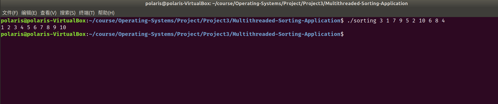
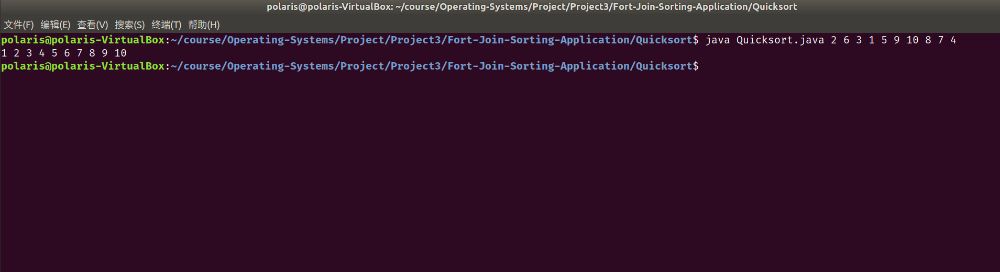
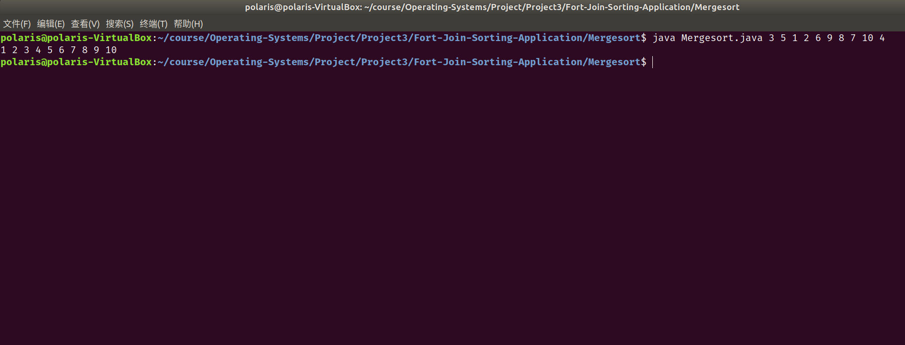

# Project3 实验报告

 余北辰 519030910245


## 1 实验概述

### 1.1 实验名称
Multithreaded Sorting Application & Fork-Join Sorting Application 

### 1.2 实验内容

1. 使用c实现多线程排序，先用两个线程分别进行排序，再用第三个线程将其归并
2. 使用java实现Fork-Join排序，分别实现快速排序和归并排序

## 2 实验环境

- Ubuntu 18.04.5 LTS
- Linux version 5.4.0-72-generic
- VirtualBox 6.1.18

## 3 实验过程与结果展示

### 3.1 Multithreaded Sorting Application

思路：

1. 先将输入数组分割为两半
2. 创建两个线程，分别进行希尔排序
3. 再创建第三个线程，将已排好的两个线程归并

实现的代码如下：

```c
int *num, *ans;
int begin, mid, end;
void *sorting(void *param);
void *merging(void *param);
int main(int argc, char *argv[])
{
    pthread_t tid1, tid2, tid3;
    pthread_attr_t attr;
    begin = 0;
    end = argc - 1;
    mid = (begin + end) / 2;

    num = (int *)malloc(end * sizeof(int));
    ans = (int *)malloc(end * sizeof(int));

    void *flag_1 = "1";
    void *flag_2 = "2";

    if (argc < 2)
    {
        fprintf(stderr, "Please input at least one number!\n");
        return -1;
    }
    for (int i = 1; i <= end; ++i)
    {
        num[i - 1] = atoi(argv[i]);
        if (num[i - 1] == 0 && strcmp(argv[i], "0") != 0)
        {
            fprintf(stderr, "Please input valid numbers!\n");
            return -1;
        }
    }

    pthread_attr_init(&attr);
    pthread_create(&tid1, &attr, sorting, flag_1);
    pthread_create(&tid2, &attr, sorting, flag_2);
    pthread_join(tid1, NULL);
    pthread_join(tid2, NULL);
    pthread_create(&tid3, &attr, merging, NULL);
    pthread_join(tid3, NULL);

    for (int i = begin; i < end; ++i)
    {
        printf("%d ", ans[i]);
    }
    printf("\n");
    free(num);
    free(ans);
    return 0;
}

```

`sorting()`函数的实现如下：

```c
void *sorting(void *param)
{
    int left, right;
    if (atoi(param) == 1)
    {
        left = begin;
        right = mid;
    }
    else
    {
        left = mid;
        right = end;
    }
    int len = right - left;
    int gap;
    int tmp;
    int k;
    for (gap = len / 2; gap > 0; gap /= 2)
    {
        for (int i = left; i < right; ++i)
        {
            int tmp = num[i];
            int j = i - gap;
            while(j>=left && tmp<=num[j])
            {
                num[j + gap] = num[j];
                j -= gap;
            }
            num[j + gap] = tmp;
        }
    }
    pthread_exit(0);
}
```

`merging()`函数的实现如下：

```c
void *merging(void *param)
{
    int a = begin, b = mid;
    int i = begin;
    while (a < mid && b < end)
    {
        if (num[a] <= num[b])
        {
            ans[i] = num[a];
            i++;
            a++;
        }
        else
        {
            ans[i] = num[b];
            i++;
            b++;
        }
    }
    while (a < mid)
    {
        ans[i] = num[a];
        i++;
        a++;
    }
    while (b < end)
    {
        ans[i] = num[b];
        i++;
        b++;
    }
    pthread_exit(0);
}
```

测试结果如下：




### 3.2 Fork-Join Sorting Application 

由于没有java的基础，所以我选择对源代码中数组求和的代码进行修改。

#### 快速排序

使用`fork`和`join`函数代替c中的`pthread_create`和`pthread_join`函数。

```java
import java.util.concurrent.*;

public class Quicksort extends RecursiveAction {

    static final int THRESHOLD = 5;

    private int begin;
    private int end;
    private int[] array;

    public Quicksort(int begin, int end, int[] array) {
        this.begin = begin;
        this.end = end;
        this.array = array;
    }

    protected void compute() {
        if (end - begin < THRESHOLD) {
            for (int i = begin; i < end; ++i) {
                for (int j = begin; j < end; ++j) {
                    int tmp;
                    if (array[j] > array[j + 1]) {
                        tmp = array[j + 1];
                        array[j + 1] = array[j];
                        array[j] = tmp;
                    }
                }
            }
        } else {
            int tmp = array[begin];
            int i, j;
            i = begin;
            j = end;

            while (i != j) {
                while (j > i && array[j] >= tmp) {
                    --j;
                }
                if (i < j) {
                    array[i] = array[j];
                    ++i;
                }
                while (i < j && array[i] < tmp) {
                    ++i;
                }
                if (i < j) {
                    array[j] = array[i];
                    --j;
                }
            }
            array[i] = tmp;
            Quicksort leftTask = new Quicksort(begin, i - 1, array);
            Quicksort rightTask = new Quicksort(i + 1, end, array);

            leftTask.fork();
            rightTask.fork();
            leftTask.join();
            rightTask.join();
        }
    }

    public static void main(String[] args) {
        ForkJoinPool pool = new ForkJoinPool();
        int size = args.length;
        int[] array = new int[size];

        for (int i = 0; i < size; i++) {
            array[i] = Integer.parseInt(args[i]);
        }

        Quicksort task = new Quicksort(0, size - 1, array);
        pool.invoke(task);

        for (int i = 0; i < size; i++) {
            System.out.print(array[i] + " ");
        }
        System.out.println("");

    }
}
```

测试结果：




#### 归并排序

与快速排序类似，只是换用了归并排序：

```java
import java.util.concurrent.*;

public class Mergesort extends RecursiveAction {

    static final int THRESHOLD = 5;

    private int begin;
    private int end;
    private int[] array;

    public Mergesort(int begin, int end, int[] array) {
        this.begin = begin;
        this.end = end;
        this.array = array;
    }

    public static void Merge(int[] array, int left, int midd, int right) {

        int a = left, b = midd;
        int i = 0;
        int[] tmp = new int[right - left + 1];
        while (a < midd && b <= right) {
            if (array[a] <= array[b]) {
                tmp[i] = array[a];
                i++;
                a++;
            } else {
                tmp[i] = array[b];
                i++;
                b++;
            }
        }
        while (a < midd) {
            tmp[i] = array[a];
            i++;
            a++;
        }
        while (b <= right) {
            tmp[i] = array[b];
            i++;
            b++;
        }
        for (int k = 0; k < i; ++k) {
            array[left + k] = tmp[k];
        }
    }

    protected void compute() {
        if (end - begin < THRESHOLD) {
            for (int i = begin; i < end; ++i) {
                for (int j = begin; j < end; ++j) {
                    int tmp;
                    if (array[j] > array[j + 1]) {
                        tmp = array[j + 1];
                        array[j + 1] = array[j];
                        array[j] = tmp;
                    }
                }
            }
        } else {
            int mid = (begin + end) / 2;
            Mergesort left = new Mergesort(begin, mid, array);
            Mergesort right = new Mergesort(mid + 1, end, array);
            left.fork();
            right.fork();
            left.join();
            right.join();
            Merge(array, begin, mid + 1, end);
        }
    }

    public static void main(String[] args) {
        ForkJoinPool pool = new ForkJoinPool();
        int size = args.length;
        int[] array = new int[size];

        for (int i = 0; i < size; i++) {
            array[i] = Integer.parseInt(args[i]);
        }

        Mergesort task = new Mergesort(0, size - 1, array);
        pool.invoke(task);

        for (int i = 0; i < size; i++) {
            System.out.print(array[i] + " ");
        }
        System.out.println("");

    }
}
```

测试结果：



## 4 实验总结

1. Multithreaded Sorting Application使用了pthread，所以编译的时候要加上`lpthread`参数
2. 这是我第一次接触java代码。由于java和c有很多类似之处，而且实验给出了类似的源代码，只要在上面进行修改即可，因此并没有碰到太多的困难

## 5 实验参考资料

* 实验参考书籍：Operating System Concept，$10^{th}$ edition
* 实验源代码网址：https://github.com/greggagne/osc10e