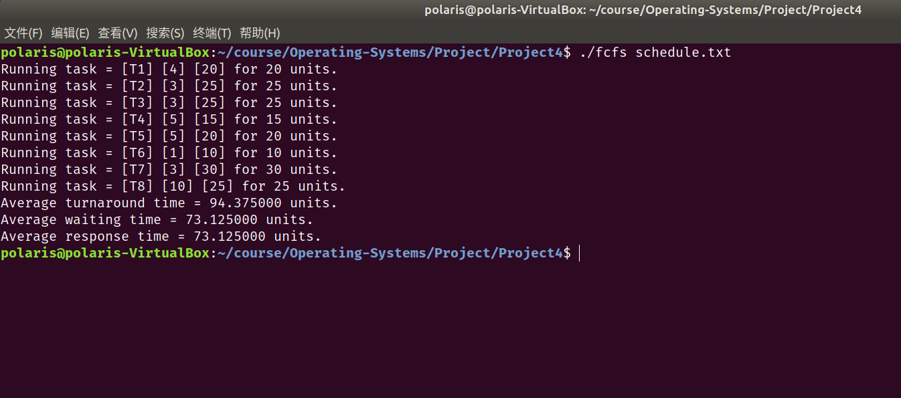
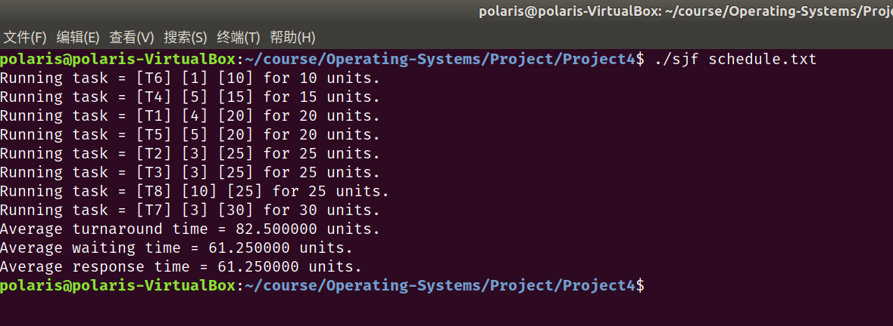
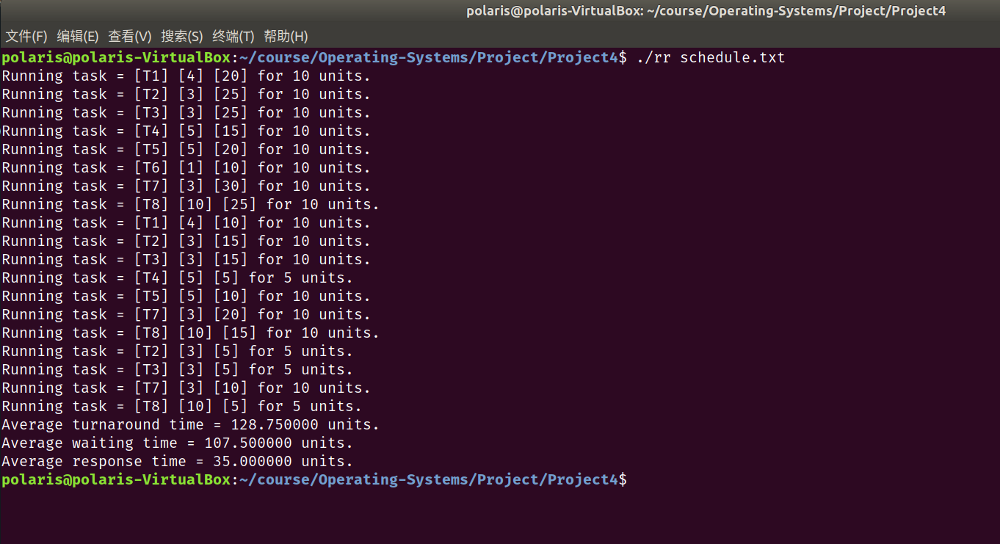
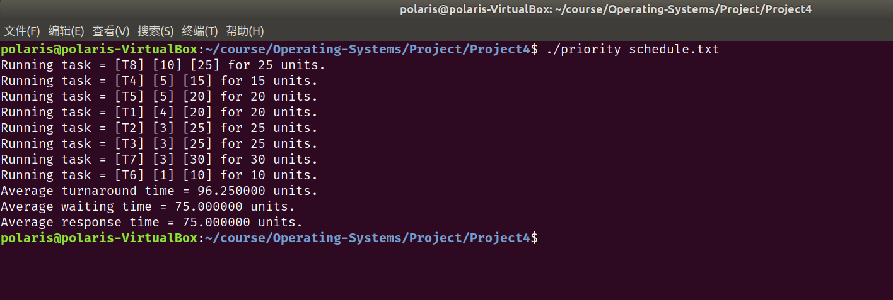
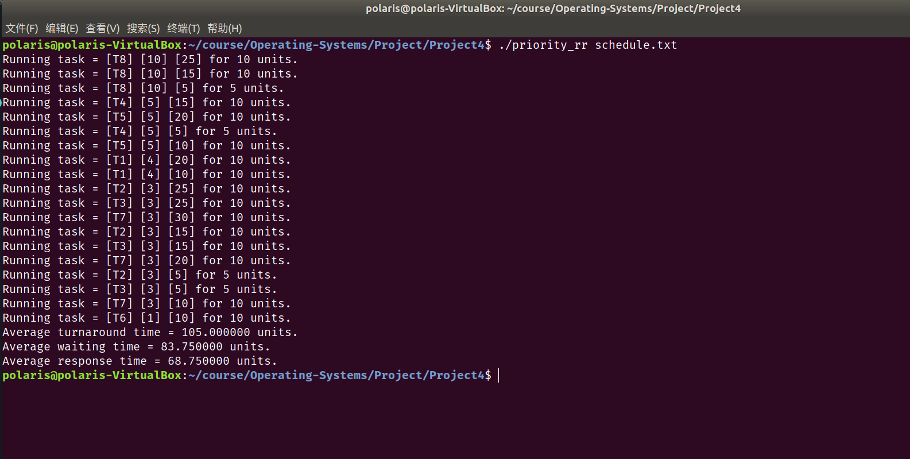

# Project4 实验报告

 余北辰 519030910245


## 1 实验概述

### 1.1 实验名称
Scheduling Algorithms

### 1.2 实验内容

1. 模拟FCFS, SJF, Priority, RR, Priority_rr五种不同的调度方案
2. 计算每种方案的平均周转时间，平均等待时间和平均响应时间。

## 2 实验环境

- Ubuntu 18.04.5 LTS
- Linux version 5.4.0-72-generic
- VirtualBox 6.1.18

## 3 实验过程与结果展示

在提供的源代码中，其他的部分已经为我们写好，我们所需要做的就是补充好五个schedule.h文件，完成其中的`add()`函数和`schedule()`函数，分别实现添加进程到就绪队列以及实现对应的进程调度的功能。

为了进行平均周转时间，平均等待时间和平均响应时间的计算，在task.h中添加变量：

```c
extern int task_tid;
extern int total_turnaround_time;
extern int total_waiting_time;
extern int total_response_time;
```

在driver.c中添加输出：

```c
    printf("Average turnaround time = %lf units.\n", 1.0 * total_turnaround_time / task_tid);
    printf("Average waiting time = %lf units.\n", 1.0 * total_waiting_time / task_tid);
    printf("Average response time = %lf units.\n", 1.0 * total_response_time / task_tid);
```


### 3.1 FCFS

FCFS的实现最为简单。

对于add函数，只要简单地将新进程添加到就绪队列的末尾即可。这里根据课本的提示，使用`__sync_fetch_and_add()`函数，原子地实现tid的自加1。

```c
void add(char *name, int priority, int burst)
{
    Task *new_task = malloc(sizeof(Task));
    new_task->burst = burst;
    new_task->name = name;
    new_task->priority = priority;
    new_task->response_time = new_task->turnaround_time = new_task->waiting_time = 0;
    new_task->tid = __sync_fetch_and_add(&task_tid, 1);
    insert(&task_list, new_task);
}
```

调度算法的实现也较为简单，只要将就绪队列链表从头结点开始遍历即可：

```c
void schedule()
{
    int time = 0;
    Node *p = task_list;
    while (p != NULL)
    {
        while (p->next != NULL)
        {
            p = p->next;
        }
        int slice = p->task->burst;
        run(p->task, slice);
        p->task->waiting_time = p->task->response_time = time;
        time += slice;
        p->task->turnaround_time = time;
        __sync_fetch_and_add(&total_response_time, p->task->response_time);
        __sync_fetch_and_add(&total_turnaround_time, p->task->turnaround_time);
        __sync_fetch_and_add(&total_waiting_time, p->task->waiting_time);
        delete (&task_list,p->task);
        free(p->task);
        p = task_list;
    }
}
```

测试结果：




### 3.2 SJF

SJF的`add()`函数和FCFS相同，都只需要将新进程添加到就绪队列的末尾即可。

`schedule()`如下，每次都寻找就绪队列中最短运行时间的进程：

```c
void schedule()
{
    int time = 0;
    Node *p = task_list;
    while (p != NULL)
    {
        int shortest_burst = p->task->burst;
        Node *q = p;
        while (p->next != NULL)
        {
            p = p->next;
            if (p->task->burst <= shortest_burst)
            {
                shortest_burst = p->task->burst;
                q = p;
            }
        }
        int slice = q->task->burst;
        run(q->task, slice);
        q->task->waiting_time = q->task->response_time = time;
        time += slice;
        q->task->turnaround_time = time;
        __sync_fetch_and_add(&total_response_time, q->task->response_time);
        __sync_fetch_and_add(&total_turnaround_time, q->task->turnaround_time);
        __sync_fetch_and_add(&total_waiting_time, q->task->waiting_time);
        delete (&task_list, q->task);
        free(q->task);
        p = task_list;
    }
}
```

测试结果：



### 3.3 RR

RR的`add()`函数和FCFS相同，都只需要将新进程添加到就绪队列的末尾即可。

`schedule()`函数如下，类似于FCFS，而每次进程只允许最多slice的时间后就被中止并重新插入就绪队列的末尾：

```c
void schedule()
{
    int time = 0;
    Node *p = task_list;
    while (p != NULL)
    {
        while (p->next != NULL)
        {
            p = p->next;
        }
        int slice = p->task->burst;
        run(p->task, slice);
        p->task->waiting_time = p->task->response_time = time;
        time += slice;
        p->task->turnaround_time = time;
        __sync_fetch_and_add(&total_response_time, p->task->response_time);
        __sync_fetch_and_add(&total_turnaround_time, p->task->turnaround_time);
        __sync_fetch_and_add(&total_waiting_time, p->task->waiting_time);
        delete (&task_list,p->task);
        free(p->task);
        p = task_list;
    }
}
```

测试结果如下：



### 3.4 priority

priority调度的`add()`函数和FCFS相同，都只需要将新进程添加到就绪队列的末尾即可。

`schedule()`函数与SJF类似，每次都寻找就绪队列中最高优先级的进程：

```c
void schedule()
{
    int time = 0;
    Node *p = task_list;
    while (p != NULL)
    {
        int biggest_priority = p->task->priority;
        Node *q = p;
        while (p->next != NULL)
        {
            p = p->next;
            if (p->task->priority >= biggest_priority)
            {
                biggest_priority = p->task->priority;
                q = p;
            }
        }
        int slice = q->task->burst;
        run(q->task, slice);
        q->task->waiting_time = q->task->response_time = time;
        time += slice;
        q->task->turnaround_time = time;
        __sync_fetch_and_add(&total_response_time, q->task->response_time);
        __sync_fetch_and_add(&total_turnaround_time, q->task->turnaround_time);
        __sync_fetch_and_add(&total_waiting_time, q->task->waiting_time);
        delete (&task_list, q->task);
        free(q->task);
        p = task_list;
    }
}
```

测试结果如下：



### 3.5 priority-RR

priority-RR调度的`add()`函数和FCFS相同，都只需要将新进程添加到就绪队列的末尾即可。

而`schedule()`函数则复杂一些，属于priority和RR的结合，每次都寻找就绪队列中最高优先级的进程，且只允许运行最多slice的时间后就被中止并重新插入就绪队列的末尾：

```c
void schedule()
{
    int slice = QUANTUM;
    int time = 0;
    Node *p = task_list;
    while (p != NULL)
    {
        int biggest_priority = p->task->priority;
        Node *q = p;
        while (p->next != NULL)
        {
            p = p->next;
            if (p->task->priority >= biggest_priority)
            {
                biggest_priority = p->task->priority;
                q = p;
            }
        }
        if (q->task->burst > slice)
        {
            run(q->task, slice);
            if (q->task->response_time == -1)
                q->task->response_time = time;
            q->task->burst -= slice;
            time += slice;
            delete (&task_list, q->task);
            insert(&task_list, q->task);
        }
        else if (q->task->burst <= slice)
        {
            run(q->task, q->task->burst);
            if (q->task->response_time == -1)
                q->task->response_time = time;
            time += q->task->burst;
            q->task->turnaround_time = time;
            q->task->waiting_time = time - q->task->origin_burst;
            __sync_fetch_and_add(&total_response_time, q->task->response_time);
            __sync_fetch_and_add(&total_turnaround_time, q->task->turnaround_time);
            __sync_fetch_and_add(&total_waiting_time, q->task->waiting_time);
            delete (&task_list, q->task);
            free(q->task);
        }
        p = task_list;
    }
}
```

测试结果如下：



## 4 实验总结

1. 由于本实验的大体框架已经搭好，所要做的只是修改代码而已，因此整体难度不太大
2. RR和priority-RR调度算法在打印时，一开始没有减去已经运行过的时间，后来已改正

## 5 实验参考资料

* 实验参考书籍：Operating System Concept，$10^{th}$ edition
* 实验源代码网址：https://github.com/greggagne/osc10e