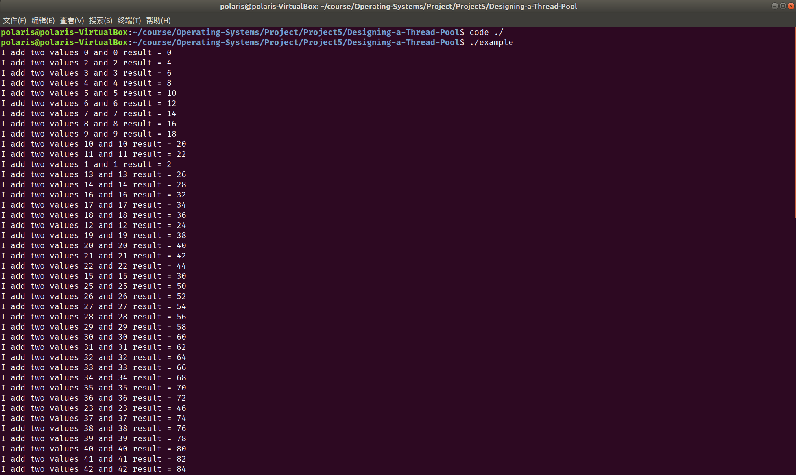
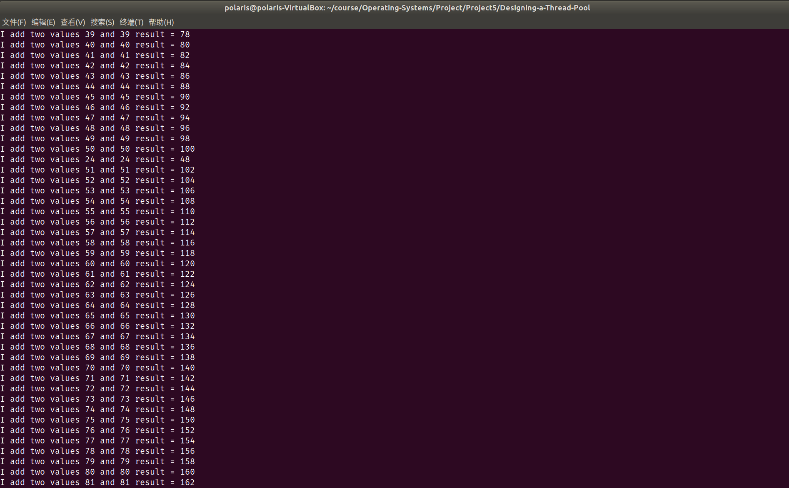
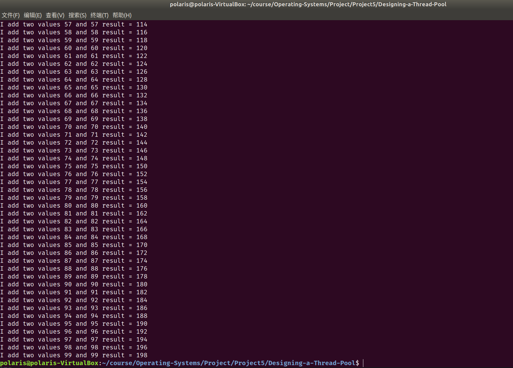
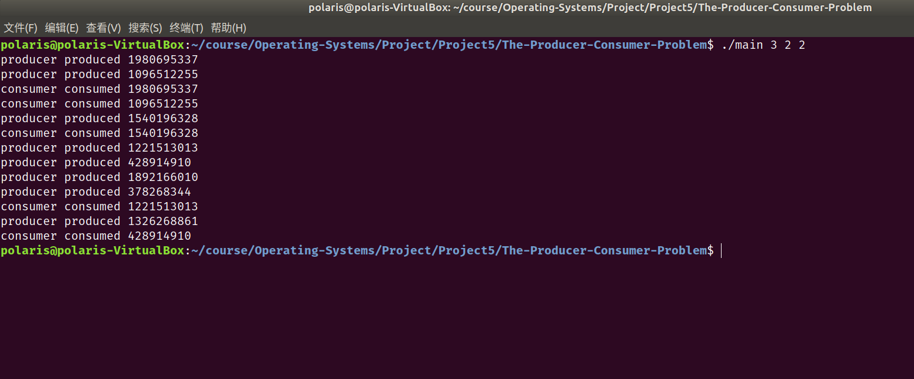

# Project5 实验报告

 余北辰 519030910245


## 1 实验概述

### 1.1 实验名称
Designing a Thread Pool & Producer-Consumer Problem

### 1.2 实验内容

1. 模拟线程池
2. 模拟解决生产者-消费者问题

## 2 实验环境

- Ubuntu 18.04.5 LTS
- Linux version 5.4.0-72-generic
- VirtualBox 6.1.18

## 3 实验过程与结果展示

### 3.1 Designing a Thread Pool

#### 测试用函数

在`client.c`文件中设计用于测试的函数：

```c
int main(void)
{
    // create some work to do
    pool_init();
    struct data work[100];
    for (int i = 0; i < 100; ++i)
    {
        work[i].a = i;
        work[i].b = i;
        // submit the work to the queue
        pool_submit(&add, &work[i]);
    }
    sleep(3);

    pool_shutdown();

    return 0;
}

```

每一个线程都用来进行两个相同数字的加法，一共有100个线程。

#### 变量定义与初始化

这里我们通过循环数组的形式实现线程池中的工作队列。

这里工作队列的`enqueue()`和`dequeue()`问题类似于生产者-消费者问题，因此引入`mutex`,`full`和`empty`三个信号量以解决同步问题。

```c
typedef struct
{
    void (*function)(void *p);
    void *data;
} task;

// the work queue
task workqueue[QUEUE_SIZE];

sem_t mutex;
sem_t full;
sem_t empty;
int shutdown;

// the worker bee
pthread_t bee[NUMBER_OF_THREADS];
int rear, front;
```

在`pool_init()`函数中实现变量的初始化：

mutex初始化为1。

初始时，工作队列为空，故将full初始化为0，而empty初始化为工作队列的大小。

使用`pthread_create()`函数，启动线程池里的所有的线程。

```c
void pool_init(void)
{
    shutdown = 0;
    rear = front = 0;
    sem_init(&mutex, 0, 1);
    sem_init(&full, 0, 0);
    sem_init(&empty, 0, QUEUE_SIZE);
    for (int i = 0; i < NUMBER_OF_THREADS; ++i)
    {
        pthread_create(&bee[i], NULL, worker, NULL);
    }
}
```

#### 入队与出队

使用`enqueue()`和`dequeue()`实现新任务加入队尾和队首任务离开工作队列。

入队时，首先要检查工作队列中是否有空位(`empty`)；入队后，要维护工作队列中元素个数，令其加一(`full`)；

出队时，首先要检查工作队列中是否有元素(`full`)；出队后，要维护工作队列中空位个数，令其加一(`empty`);

```c
// insert a task into the queue
// returns 0 if successful or 1 otherwise,
void enqueue(task t)
{
    sem_wait(&empty);
    sem_wait(&mutex);
    workqueue[rear] = t;
    rear = (rear + 1) % QUEUE_SIZE;
    //currentsize++;
    sem_post(&mutex);
    sem_post(&full);
}

// remove a task from the queue
task dequeue()
{
    task work_to_dequeue;
    sem_wait(&full);
    sem_wait(&mutex);
    work_to_dequeue = workqueue[front];
    front = (front + 1) % QUEUE_SIZE;
    //currentsize--;
    sem_post(&mutex);
    sem_post(&empty);
    return work_to_dequeue;
}
```

#### 线程的运行

`worker()`函数不断调用`dequeue()`令工作队列的队首出队，再调用`execute()`执行相应进程；

```c
// the worker thread in the thread pool
void *worker(void *param)
{
    // execute the task
    task work_to_do;
    while (TRUE)
    {
        work_to_do = dequeue();
        if (shutdown)
            pthread_exit(0);
        execute(work_to_do.function, work_to_do.data);
    }
}

/**
 * Executes the task provided to the thread pool
 */
void execute(void (*somefunction)(void *p), void *p)
{
    (*somefunction)(p);
}
```

#### 新任务的提交

而`pool_submit()`的功能是提交新任务，使新任务加入工作队列：

```c
int pool_submit(void (*somefunction)(void *p), void *p)
{
    task work_to_submit;
    work_to_submit.function = somefunction;
    work_to_submit.data = p;
    enqueue(work_to_submit);

    return 0;
}
```

#### 线程的释放

`pool_shutdown()`的功能是将各个线程都释放掉。首先让因为信号量`full`而一直等待的线程解除阻塞，再调用`pthread_join()`函数。

```c
// shutdown the thread pool
void pool_shutdown(void)
{
    shutdown = 1;
    for (int i = 0; i < NUMBER_OF_THREADS; ++i)
        sem_post(&full);
    for (int i = 0; i < NUMBER_OF_THREADS; ++i)
        pthread_join(bee[i], NULL);
}
```

#### 测试结果







测试结果正常。

### 3.2 Producer-Consumer Problem

#### buffer的实现

与Thread Pool中工作队列的实现类似，通过循环队列实现`buffer`，定义`empty`和`full`两个信号量以及互斥锁`mutex`，分别定义`insert`和`remove`操作：

```c
#include "buffer.h"
#include <semaphore.h>
#include <pthread.h>
#include <stdio.h>

buffer_item buffer[BUFFER_SIZE];
sem_t empty;
sem_t full;
pthread_mutex_t mutex;
int rear, front;


void init()
{
    rear = front = 0;
    sem_init(&empty, 0, BUFFER_SIZE);
    sem_init(&full, 0, 0);
    pthread_mutex_init(&mutex, 0);
}

int insert_item(buffer_item item)
{
    sem_wait(&empty);
    pthread_mutex_lock(&mutex);
    buffer[rear] = item;
    rear = (rear + 1) % BUFFER_SIZE;
    pthread_mutex_unlock(&mutex);
    sem_post(&full);
    return 0;
}

int remove_item(buffer_item *item)
{
    sem_wait(&full);
    pthread_mutex_lock(&mutex);
    *item = buffer[front];
    front = (front + 1) % BUFFER_SIZE;
    pthread_mutex_unlock(&mutex);
    sem_post(&empty);
    return 0;
}
```

#### 主函数的实现

分别定义producer和consumer线程；

在运行`sleep_time`的时间后将所有进程依次释放；

按照课本要求，在producer和consumer线程中使用`rand()`函数在`sleep_time`的时间范围内随机得到进程睡眠的时间。

代码如下：

```c
#include <stdlib.h>
#include <unistd.h>
#include <stdio.h>
#include <pthread.h>

#include "buffer.h"

int sleep_time, producer_num, consumer_num;
void *producer(void *param)
{
    buffer_item item;
    while (1)
    {
        sleep(rand() % sleep_time);
        item = rand();
        if (insert_item(item))
            fprintf(stderr, "report error condition");
        else
            printf("producer produced %d\n", item);
    }
}

void *consumer(void *param)
{
    buffer_item item;
    while (1)
    {
        sleep(rand() % sleep_time);
        if (remove_item(&item))
            fprintf(stderr, "report error condition");
        else
            printf("consumer consumed %d\n", item);
    }
}

int main(int argc, char *argv[])
{
    if (argc != 4)
    {
        fprintf(stderr, "report error condition");
        return -1;
    }

    srand((int)time(0));

    sleep_time = atoi(argv[1]);
    producer_num = atoi(argv[2]);
    consumer_num = atoi(argv[3]);

    init();

    pthread_t producers[producer_num];
    pthread_t consumers[consumer_num];

    for (int i = 0; i < producer_num; ++i)
    {
        pthread_create(&producers[i], 0, producer, 0);
    }

    for (int i = 0; i < consumer_num; ++i)
    {
        pthread_create(&consumers[i], 0, consumer, 0);
    }

    sleep(sleep_time);

    for (int i = 0; i < producer_num; i++)
        pthread_cancel(producers[i]);

    for (int i = 0; i < consumer_num; i++)
        pthread_cancel(consumers[i]);
    return 0;
}
```

#### 测试结果



测试结果正常。

## 4 实验总结

1. 根据提示，在`client.c`文件中添加语句`sleep(3);`，保证所有提交的任务都能正常执行完毕；
2. 无论是信号量还是互斥锁，无论是在初始化时还是在P/V操作时，在相对应函数中传递的参数都是该变量的地址。

## 5 实验参考资料

* 实验参考书籍：Operating System Concept，$10^{th}$ edition
* 实验源代码网址：https://github.com/greggagne/osc10e

