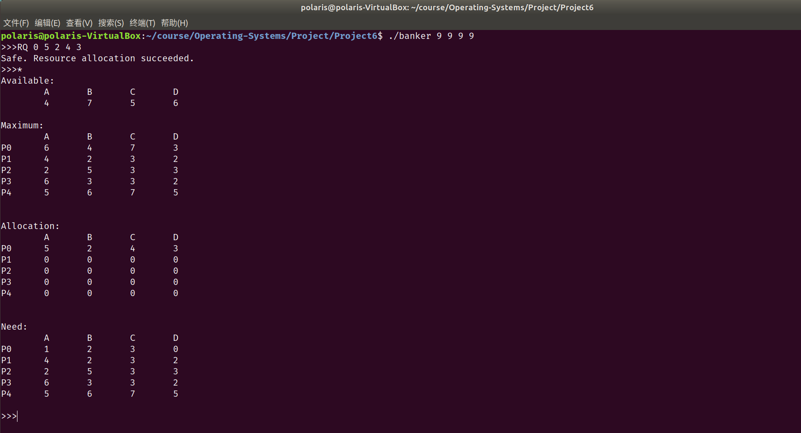
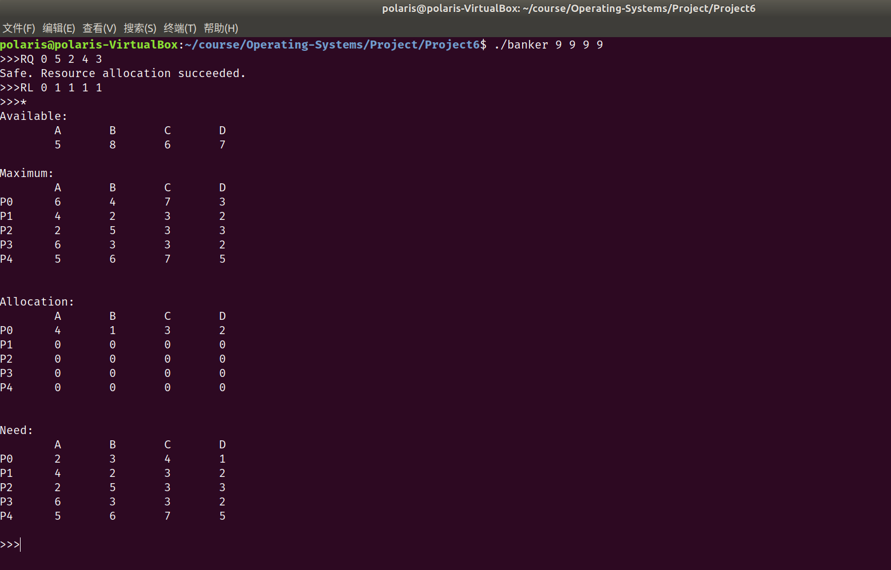
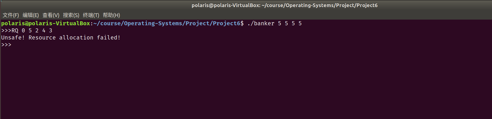

# Project6 实验报告

 余北辰 519030910245


## 1 实验概述

### 1.1 实验名称
Banker's Algorithm

### 1.2 实验内容

1. 实现银行家算法
2. 维护available, maximum, allocation, need四个资源数组，通过`*`命令打印各数组的值
3. 通过`RQ`命令请求资源、`RL`命令释放资源

## 2 实验环境

- Ubuntu 18.04.5 LTS
- Linux version 5.4.0-72-generic
- VirtualBox 6.1.18

## 3 实验过程与结果展示

### 3.1 安全状态检验

银行家算法需要四个资源数组：

```c
int available[NUMBER_OF_RESOURCES];
int maximum[NUMBER_OF_CUSTOMERS][NUMBER_OF_RESOURCES];
int allocation[NUMBER_OF_CUSTOMERS][NUMBER_OF_RESOURCES];
int need[NUMBER_OF_CUSTOMERS][NUMBER_OF_RESOURCES];
```

`available`数组存储各种资源剩余可用的数量；

`maximum`数组存储每个客户对每种资源的总需求；

`allocation`数组存储每个客户当前分配到的每种资源的数量；

`need`数组存储每个客户对每种资源的剩余需求。


安全状态检验函数`check_safe()`需要引入`finish`与`work`两个数组。`finish`数组标记各个客户是否已经完成对资源的使用；`work`数组则储存各资源的当前可用数量；

首先让`finish`数组初始化为0，`work`数组则初始化为`available`数组的值。

循环检查各客户的剩余需求能否被当前空闲资源所满足；若能够满足，则先将空闲资源分配予其，待其使用完毕后释放其现有资源。由于我们只是模拟银行家算法，因此省略中间过程，直接将其现有资源释放，即`work`数组加上该客户的`allocation`数组。该客户的`finish`数组被标记为1。

不断循环上面的过程，直到所有的客户的`finish`数组都被标记为1，`check_safe()`返回0，或者当前空闲资源无法满足剩下任何一个客户的需求了，`check_safe()`返回-1。

代码具体实现如下：

```c
int check_safe(int allocation[][NUMBER_OF_RESOURCES], int need[][NUMBER_OF_RESOURCES], int available[])
{
    int safe = 0;
    int finish[NUMBER_OF_CUSTOMERS];
    int work[NUMBER_OF_RESOURCES];
    for (int i = 0; i < NUMBER_OF_CUSTOMERS; ++i)
    {
        finish[i] = 0;
    }
    for (int i = 0; i < NUMBER_OF_RESOURCES; ++i)
    {
        work[i] = available[i];
    }
    int all_finished;
    int all_checked;
    while (1)
    {
        all_finished = 1;
        all_checked = 1;
        for (int i = 0; i < NUMBER_OF_CUSTOMERS; ++i)
        {
            if (finish[i] == 0)
                all_finished = 0;
            else
                continue;

            int flag = 1;
            for (int j = 0; j < NUMBER_OF_RESOURCES; ++j)
            {
                if (need[i][j] > work[j])
                    flag = 0;
            }

            if (flag)
            {
                all_checked = 0;
                for (int j = 0; j < NUMBER_OF_RESOURCES; ++j)
                {
                    work[j] += allocation[i][j];
                    finish[i] = 1;
                }
            }
        }

        if (all_checked || all_finished)
            break;
    }
    if (all_finished == 1)
        return 0;
    else
        return -1;
}
```

### 3.2 资源请求

在请求资源时，先要调用安全状态检验函数，保证处于安全状态才分配资源；否则不予分配。

```c
int request_resources(int num, int request[])
{
    if (num < 0 || num >= NUMBER_OF_CUSTOMERS)
    {
        fprintf(stderr, "Error customer id!\n");
        return -1;
    }
    int available_[NUMBER_OF_RESOURCES];
    int allocation_[NUMBER_OF_CUSTOMERS][NUMBER_OF_RESOURCES];
    int need_[NUMBER_OF_CUSTOMERS][NUMBER_OF_RESOURCES];

    for (int i = 0; i < NUMBER_OF_RESOURCES; ++i)
    {
        available_[i] = available[i];
        for (int j = 0; j < NUMBER_OF_CUSTOMERS; ++j)
        {
            allocation_[j][i] = allocation[j][i];
            need_[j][i] = need[j][i];
        }
    }

    for (int i = 0; i < NUMBER_OF_RESOURCES; ++i)
    {
        allocation_[num][i] += request[i];
        need_[num][i] -= request[i];
        available_[i] -= request[i];
    }

    int safe = check_safe(allocation_, need_, available_);
    if (safe == 0)
    {
        for (int i = 0; i < NUMBER_OF_RESOURCES; ++i)
        {
            allocation[num][i] += request[i];
            need[num][i] -= request[i];
            available[i] -= request[i];
        }
        printf("Safe. Resource allocation succeeded.\n");
        return 0;
    }
    else
    {
        fprintf(stderr, "Unsafe! Resource allocation failed!\n");
        return -1;
    }
```

### 3.3 资源释放

资源释放的过程相比之下简单一些，只需要检查一下是否有足够的资源供给释放，再释放所选资源即可。

```c
int release_resources(int num, int release[])
{
    if (num < 0 || num >= NUMBER_OF_CUSTOMERS)
    {
        fprintf(stderr, "Error customer id!\n");
        return -1;
    }
    for (int i = 0; i < NUMBER_OF_RESOURCES; ++i)
    {
        if (allocation[num][i] < release[i])
        {
            fprintf(stderr, "Don't have so much to release!\n");
            return -1;
        }
    }
    for (int i = 0; i < NUMBER_OF_RESOURCES; ++i)
    {
        available[i] += release[i];
        need[num][i] += release[i];
        allocation[num][i] -= release[i];
    }
    return 0;
}
```

### 3.4 其他部分

打印资源数组:

```c
void print_resources()
{
    printf("Available:\n");
    printf("  \tA\tB\tC\tD\n");
    printf("  \t");
    for (int i = 0; i < NUMBER_OF_RESOURCES; ++i)
    {
        printf("%d\t", available[i]);
    }
    printf("\n");
    printf("\n");
    printf("Maximum:\n");
    printf("  \tA\tB\tC\tD\n");
    for (int i = 0; i < NUMBER_OF_CUSTOMERS; ++i)
    {
        printf("P%d\t", i);
        for (int j = 0; j < NUMBER_OF_RESOURCES; ++j)
        {
            printf("%d\t", maximum[i][j]);
        }
        printf("\n");
    }
    printf("\n");
    printf("\n");
    printf("Allocation:\n");
    printf("  \tA\tB\tC\tD\n");
    for (int i = 0; i < NUMBER_OF_CUSTOMERS; ++i)
    {
        printf("P%d\t", i);
        for (int j = 0; j < NUMBER_OF_RESOURCES; ++j)
        {
            printf("%d\t", allocation[i][j]);
        }
        printf("\n");
    }
    printf("\n");
    printf("\n");
    printf("Need:\n");
    printf("  \tA\tB\tC\tD\n");
    for (int i = 0; i < NUMBER_OF_CUSTOMERS; ++i)
    {
        printf("P%d\t", i);
        for (int j = 0; j < NUMBER_OF_RESOURCES; ++j)
        {
            printf("%d\t", need[i][j]);
        }
        printf("\n");
    }
    printf("\n");
}
```

`input.txt`文件的读取，通过`read_file()`函数获得各资源数组的初始值：

```c
int read_file()
{
    FILE *f;
    f = fopen("input.txt", "r");
    if (f == NULL)
    {
        fprintf(stderr, "File not found!\n");
        return 0;
    }
    else
    {
        for (int i = 0; i < NUMBER_OF_CUSTOMERS; ++i)
            for (int j = 0; j < NUMBER_OF_RESOURCES; ++j)
            {
                fscanf(f, "%d", &maximum[i][j]);
                fgetc(f);
            }
        for (int i = 0; i < NUMBER_OF_CUSTOMERS; ++i)
            for (int j = 0; j < NUMBER_OF_RESOURCES; ++j)
            {
                need[i][j] = maximum[i][j];
                allocation[i][j] = 0;
            }
        return 0;
    }
}
```

`main()`函数中，需要完成对用户的命令的识别与选择：

```c
int main(int argc, char *argv[])
{
    if (argc != 5)
    {
        fprintf(stderr, "Error input!\n");
        return -1;
    }

    for (int i = 1; i <= NUMBER_OF_RESOURCES; ++i)
    {
        available[i - 1] = atoi(argv[i]);
    }

    if (read_file() != 0)
        return -1;

    while (1)
    {
        printf(">>>");
        char ch[10];
        scanf("%s", ch);
        if (strcmp(ch, "exit") == 0)
        {
            break;
        }
        else if (strcmp(ch, "*") == 0)
        {
            print_resources();
            continue;
        }
        else if (strcmp(ch, "RQ") == 0)
        {
            int num;
            scanf("%d", &num);
            int request[NUMBER_OF_RESOURCES];
            for (int i = 0; i < NUMBER_OF_RESOURCES; ++i)
            {
                scanf("%d", &request[i]);
            }
            request_resources(num, request);
        }
        else if (strcmp(ch, "RL") == 0)
        {
            int num;
            scanf("%d", &num);
            int release[NUMBER_OF_RESOURCES];
            for (int i = 0; i < NUMBER_OF_RESOURCES; ++i)
            {
                scanf("%d", &release[i]);
            }
            release_resources(num, release);
        }
        else
        {
            fprintf(stderr, "Error input!\n");
        }
    }

    return 0;
}
```

### 3.5 测试结果

`input.txt`如下：

```txt
6,4,7,3
4,2,3,2
2,5,3,3
6,3,3,2
5,6,7,5
```

测试资源请求：



测试资源释放：



测试不安全状态的检验：



## 4 实验总结

1. 调用安全状态检验函数时，注意要将当前的资源数组拷贝一份，并使用备份的资源数组进行检验。因为安全状态检验函数是指针传递，会改变资源数组的值。

## 5 实验参考资料

* 实验参考书籍：Operating System Concept，$10^{th}$ edition
* 实验源代码网址：https://github.com/greggagne/osc10e

