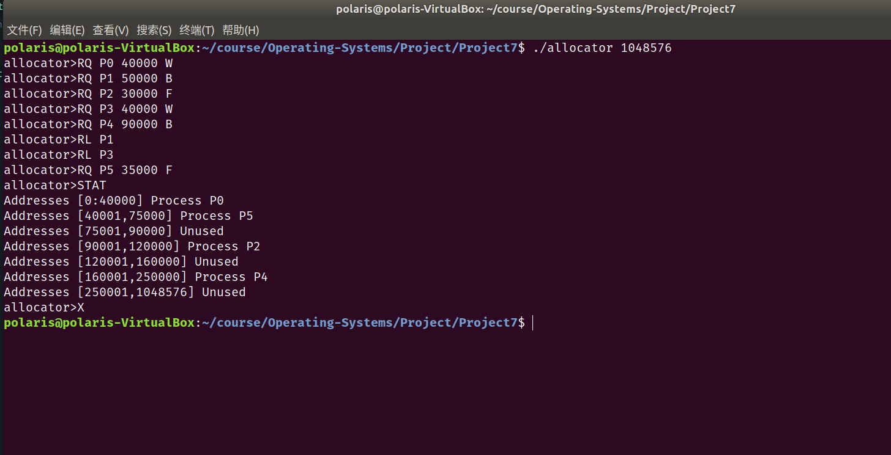
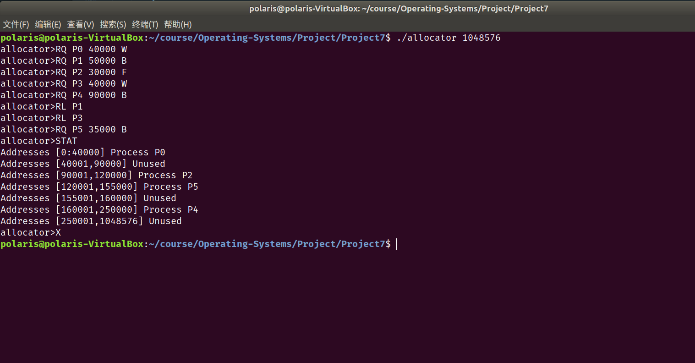
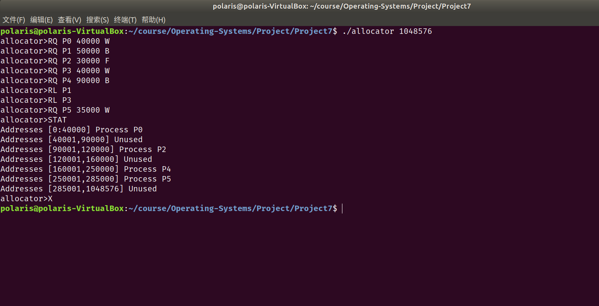
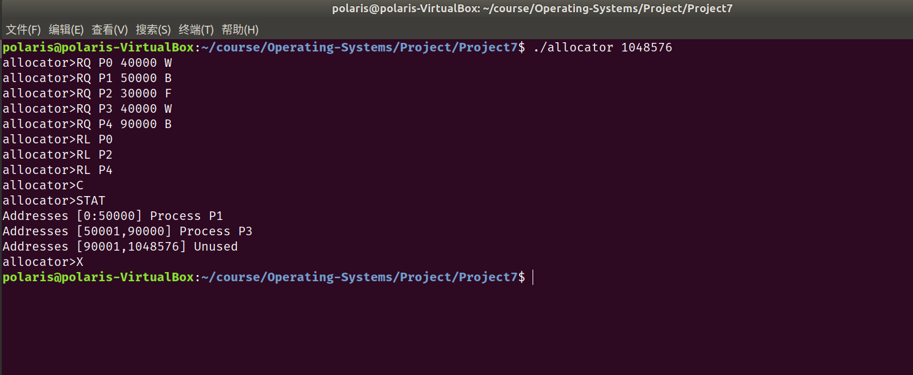

# Project7 实验报告

 余北辰 519030910245


## 1 实验概述

### 1.1 实验名称
Contiguous Memory Allocation

### 1.2 实验内容

1. 实现动态内存分配的模拟
2. 实现对`RQ`、`RL`、`C`、`STAT`、`X`五种指令的读取，并分别实现内存申请、内存释放、内存紧缩、打印现有状态和结束模拟的功能
3. 内存申请时根据指令`F`,`B`,`W`分别进行First-fit,Best-fit和Worst-fit分配

## 2 实验环境

- Ubuntu 18.04.5 LTS
- Linux version 5.4.0-72-generic
- VirtualBox 6.1.18

## 3 实验过程与结果展示

使用链表维护内存空间。

### 3.1 变量定义

定义`Hole`这一结构，`begin`、`end`、`size`分别代表某一内存块的起始位置、终止位置和内存块的大小；`used`代表这一内存块是已然被分配给某一进程的，还是尚未分配的；`name`指针指向所分配的进程的名称，若未分配则指向空字符串。

```c
int total_memory;

typedef struct Hole
{
    int begin;
    int end;
    int size;
    int used;
    char *name;
} Hole;

typedef struct Node
{
    struct Node *next;
    struct Hole hole;
} Node;

Node *head;
```

### 3.2 内存申请

#### First-fit

从头节点开始，一直向后寻找，直至找到第一个未被使用，且大小足够的`Hole`。

找到合适的`Hole`之后，将这个`Hole`分裂，靠前的部分修改为已分配状态，靠后的部分仍为未分配状态。

注意当`Hole`的大小刚好合适的时候，不需要分裂该`Hole`，只需修改该`Hole`的状态即可。

`First-fit()`实现的代码如下：

```c
void first_fit(char *name, int size)
{
    Node *p = head;
    while (1)
    {
        if (p->hole.used == 0 && p->hole.size > size)
        {
            Node *q = (Node *)malloc(sizeof(Node));
            p->hole.used = 1;
            q->hole.used = 0;
            p->hole.name = name;
            q->hole.name = "";
            q->hole.end = p->hole.end;
            p->hole.end = p->hole.begin + size;
            p->hole.size = size;
            q->hole.begin = p->hole.end;
            q->hole.size = q->hole.end - q->hole.begin;
            q->next = p->next;
            p->next = q;
            break;
        }
        else if (p->hole.used == 0 && p->hole.size == size)
        {
            p->hole.used = 1;
            p->hole.name = name;
            break;
        }
        else
        {
            if (p->next != NULL)
            {
                p = p->next;
            }
            else
            {
                fprintf(stderr, "Error: Failed! No suitable space!\n");
                break;
            }
        }
    }
}
```

#### Best-fit

Best-fit和first-fit的区别在于，要找到size最小的未分配的`Hole`。

只需先遍历链表，找到size最小的未分配的`Hole`，再类似于first-fit的操作进行分配即可。

`Best-fit()`实现的代码如下：

```c
void best_fit(char *name, int size)
{
    Node *p = head;
    int minsize = __INT_MAX__;
    Node *minnode = NULL;
    while (1)
    {
        if (p->hole.used == 0 && p->hole.size >= size)
        {
            if (p->hole.size < minsize)
            {
                minsize = p->hole.size;
                minnode = p;
            }
        }
        if (p->next != NULL)
        {
            p = p->next;
        }
        else
        {
            if (minsize == __INT_MAX__)
                fprintf(stderr, "Error: Failed! No suitable space!\n");
            break;
        }
    }
    if (minsize != __INT_MAX__)
    {
        p = minnode;
        if (minsize == size)
        {
            p->hole.used = 1;
            p->hole.name = name;
        }
        else
        {
            Node *q = (Node *)malloc(sizeof(Node));
            p->hole.used = 1;
            q->hole.used = 0;
            p->hole.name = name;
            q->hole.name = "";
            q->hole.end = p->hole.end;
            p->hole.end = p->hole.begin + size;
            p->hole.size = size;
            q->hole.begin = p->hole.end;
            q->hole.size = q->hole.end - q->hole.begin;
            q->next = p->next;
            p->next = q;
        }
    }
}
```

#### Worst-fit

Worst-fit和Best-fit很相似，只是Best-fit寻找的是size最小的未分配的`Hole`，而Worst-fit寻找的则是size最大的。

`Worst-fit()`的实现代码如下：

```c
void worst_fit(char *name, int size)
{
    Node *p = head;
    int maxsize = -1;
    Node *maxnode = NULL;
    while (1)
    {
        if (p->hole.used == 0 && p->hole.size >= size)
        {
            if (p->hole.size > maxsize)
            {
                maxsize = p->hole.size;
                maxnode = p;
            }
        }

        if (p->next != NULL)
        {
            p = p->next;
        }
        else
        {
            if (maxsize == -1)
                fprintf(stderr, "Error: Failed! No suitable space!\n");
            break;
        }
    }
    if (maxsize != -1)
    {
        p = maxnode;
        if (maxsize == size)
        {
            p->hole.used = 1;
            p->hole.name = name;
        }
        else
        {
            Node *q = (Node *)malloc(sizeof(Node));
            p->hole.used = 1;
            q->hole.used = 0;
            p->hole.name = name;
            q->hole.name = "";
            q->hole.end = p->hole.end;
            p->hole.end = p->hole.begin + size;
            p->hole.size = size;
            q->hole.begin = p->hole.end;
            q->hole.size = q->hole.end - q->hole.begin;
            q->next = p->next;
            p->next = q;
        }
    }
}
```

### 3.3 内存释放

相比内存申请而言，内存释放的操作需要更加复杂一些。因为内存申请时，只要把未分配的`Hole`分裂即可；而内存释放时，在修改对应`Hole`的状态后，还需要分多种情况考虑，让相邻的未分配的`Hole`合并起来。

而且由于涉及到修改链表各个`Node`之间的连接关系，需要使用双指针。这也意味着需要考虑释放头结点中`Hole`的特殊情况。

`release()`的具体实现过程代码如下所示：

```c
void release(char *name)
{
    Node *p = head->next;
    Node *q = head;

    while (1)
    {
        if (q == head && strcmp(q->hole.name, name) == 0)
        {
            if (p == NULL)
            {
                q->hole.begin = 0;
                q->hole.end = total_memory;
                q->hole.used = 0;
                q->hole.size = total_memory;
                q->hole.name = "";
                break;
            }
            else if (p->hole.used == 1)
            {
                q->hole.used = 0;
                q->hole.name = "";
                break;
            }
            else
            {
                q->hole.end = p->hole.end;
                q->hole.size = q->hole.end;
                q->hole.name = "";
                q->hole.used = 0;
                q->next = p->next;
                free(p);
            }
        }

        if (p == NULL)
        {
            fprintf(stderr, "Error: Failed! No that process!\n");
            break;
        }

        if (strcmp(p->hole.name, name) == 0)
        {
            Node *r = p->next;
            if (q->hole.used == 0)
            {
                if (r == NULL)
                {
                    q->hole.end = p->hole.end;
                    q->hole.size = q->hole.end - q->hole.begin;
                    q->next = p->next;
                    free(p);
                }
                else if (r->hole.used == 1)
                {
                    q->hole.end = p->hole.end;
                    q->hole.size = q->hole.end - q->hole.begin;
                    q->next = p->next;
                    free(p);
                }
                else
                {
                    q->hole.end = r->hole.end;
                    q->hole.size = q->hole.end - q->hole.begin;
                    q->next = r->next;
                    free(p);
                    free(r);
                }
            }
            else
            {
                if (r == NULL)
                {
                    p->hole.used = 0;
                    p->hole.name = "";
                }
                else if (r->hole.used == 1)
                {
                    p->hole.used = 0;
                    p->hole.name = "";
                }
                else
                {
                    p->hole.used = 0;
                    p->hole.name = "";
                    p->hole.end = r->hole.end;
                    p->hole.size = p->hole.end - p->hole.begin;
                    p->next = r->next;
                    free(r);
                }
            }
            break;
        }
        else
        {
            if (p->next != NULL)
            {
                q = q->next;
                p = p->next;
            }
            else
            {
                fprintf(stderr, "Error: Failed! No that process!\n");
                break;
            }
        }
    }
}
```

### 3.4 内存紧缩

内存紧缩的过程相对简单一些，只需要从头节点开始，凡是遇到未分配的`Hole`就令其前后`Node`相连、将其所在的`Node`删去即可。

但注意要维护`begin`和`end`的值。

同样使用了双指针，要特殊考虑头节点的情况。

对于最后一个`Hole`，也要特殊考虑。

`compact()`的具体实现代码如下：

```c
void compact()
{
    int offset = 0;
    Node *q = head;
    Node *p = head->next;
    if (head->hole.used == 0)
    {
        offset += head->hole.size;
    }
    while (1)
    {
        if (p->next == NULL)
        {
            if (p->hole.used == 0)
            {
                p->hole.begin -= offset;
                p->hole.size += offset;
            }
            else
            {
                p->hole.begin -= offset;
                p->hole.end -= offset;
                Node *end = (Node *)malloc(sizeof(Node));
                end->hole.begin = p->hole.end;
                end->hole.end = total_memory;
                end->hole.size = end->hole.end - end->hole.begin;
                end->hole.used = 0;
                end->hole.name = "";
                p->next = end;
                end->next = NULL;
            }
            break;
        }
        if (p->hole.used == 0)
        {
            offset += p->hole.size;
            q->next = p->next;
            Node *freeNode = p;
            p = p->next;
            free(freeNode);
        }
        else
        {
            p->hole.begin -= offset;
            p->hole.end -= offset;
            p = p->next;
            q = q->next;
        }
    }
    if (head->hole.used == 0 && head->next != NULL)
    {
        Node *freeNode = head;
        head = head->next;
        free(freeNode);
    }
}
```

### 3.5 其他部分

#### 打印当前状态

代码实现如下：

```c
void status_report()
{
    Node *p = head;
    while (1)
    {
        printf("Addresses ");
        if (p == head)
            printf("[%d:%d] ", p->hole.begin, p->hole.end);
        else
            printf("[%d,%d] ", p->hole.begin + 1, p->hole.end);

        if (p->hole.used == 0)
            printf("Unused \n");
        else
            printf("Process %s\n", p->hole.name);

        if (p->next != NULL)
            p = p->next;
        else
            break;
    }
}
```

#### 命令识别与选择

在`main()`函数实现。

代码如下：

```c
int main(int argc, char **argv)
{
    if (argc != 2)
    {
        fprintf(stderr, "Error: Please input right arguments!\n");
        return -1;
    }
    head = (Node *)malloc(sizeof(Node));
    head->next = NULL;

    total_memory = atoi(argv[1]);
    head->hole.begin = 0;
    head->hole.end = total_memory;
    head->hole.size = total_memory;
    head->hole.used = 0;
    head->hole.name = "";
    char buffer[20];

    while (1)
    {
        printf("allocator>");
        scanf("%s", buffer);
        if (strcmp(buffer, "RQ") == 0)
        {
            Node *q = (Node *)malloc(sizeof(Node));

            char *name_of_process = (char *)malloc(10 * sizeof(char));
            scanf("%s", name_of_process);
            int size_of_process;
            scanf("%d", &size_of_process);
            char *type = (char *)malloc(3 * sizeof(char));
            scanf("%s", type);

            if (strcmp(type, "F") == 0)
            {
                first_fit(name_of_process, size_of_process);
            }
            else if (strcmp(type, "B") == 0)
            {
                best_fit(name_of_process, size_of_process);
            }
            else if (strcmp(type, "W") == 0)
            {
                worst_fit(name_of_process, size_of_process);
            }
        }

        else if (strcmp(buffer, "RL") == 0)
        {
            char *name_of_process = (char *)malloc(10 * sizeof(char));
            scanf("%s", name_of_process);
            release(name_of_process);
            free(name_of_process);
        }
        else if (strcmp(buffer, "C") == 0)
        {
            compact();
        }
        else if (strcmp(buffer, "STAT") == 0)
        {
            status_report();
        }
        else if (strcmp(buffer, "X") == 0)
        {
            break;
        }
        else
        {
            fprintf(stderr, "Error: Please input right commands!\n");
        }
    }

    return 0;
}
```

### 3.6 测试结果

测试First-fit：



测试Best-fit：



测试Worst-fit:



测试compact：



## 4 实验总结

1. 注意在内存释放和内存紧缩时，要对相应的`Node`调用`free()`函数，以避免内存泄漏。
2. 注意要特殊考虑头尾节点。

## 5 实验参考资料

* 实验参考书籍：Operating System Concept，$10^{th}$ edition
* 实验源代码网址：https://github.com/greggagne/osc10e

