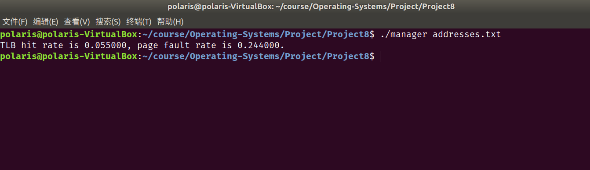
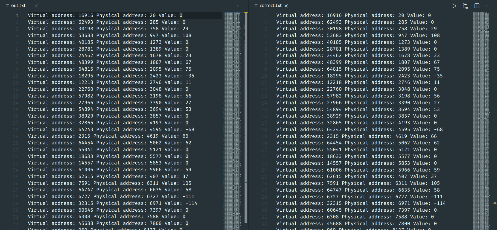

# Project8 实验报告

 余北辰 519030910245


## 1 实验概述

### 1.1 实验名称
Designing a Virtual Memory Manager

### 1.2 实验内容

1. 实现虚拟内存管理器的模拟

2. 给定page number = 256，page size = 256B，TLB entries = 16，frame size = 256B，frame number = 256，完成对TLB miss和page fault的处理。

3. 统计Page fault rate和TLB hit rate。

   

## 2 实验环境

- Ubuntu 18.04.5 LTS
- Linux version 5.4.0-72-generic
- VirtualBox 6.1.18

## 3 实验过程与结果展示

### 3.1 变量定义与初始化

首先使用宏定义，定义页大小、页条目数目等实验要求的几个常量：

```c
#define PAGE_SIZE 256
#define FRAME_SIZE 256
#define PAGE_ENTRIES_NUM 256
#define FRAME_ENTRIES_NUM 256
#define TLB_ENTRIES_NUM 16
```

分别定义页、页框和TLB的结构并声明。

由于要使用LRU算法做页面替换，因此引入`latest_used`用于记录：

```c
typedef struct
{
    int latest_used;
    int page_number;
    int frame_number;
} TLB;

typedef struct
{
    int valid;
    int frame_number;
} PAGE;

typedef struct
{
    int latest_used;
    char data[PAGE_SIZE];
} FRAME;

TLB tlb[TLB_ENTRIES_NUM];
PAGE pagetable[PAGE_ENTRIES_NUM];
FRAME memory[FRAME_ENTRIES_NUM];
```

引入`Clk`变量作为时间轴：

```c
int clk;
```

使用`init()`对各结构进行初始化：

```c
void init()
{
    for (int i = 0; i < TLB_ENTRIES_NUM;++i)
    {
        tlb[i].frame_number = tlb[i].page_number = tlb[i].latest_used = -1;
    }
    for (int i = 0; i < PAGE_ENTRIES_NUM;++i)
    {
        pagetable[i].frame_number = -1;
        pagetable[i].valid = 0;
    }
    for (int i = 0; i < FRAME_ENTRIES_NUM;++i)
    {
        memory[i].latest_used = -1;
    }
}
```

在`main()`函数中，定义三个文件的文件指针，以及一些其他所需的变量：

```c
    strcpy(address_filename, argv[1]);

    FILE *addresses = fopen(address_filename, "r");
    FILE *backing_store = fopen("BACKING_STORE.bin", "rb");
    FILE *out = fopen("out.txt", "w");

    int logical_address = 0;
    int pagefault, tlb_miss;
    double pagefault_number = 0, tlb_hit_number = 0;
    int page_offset, page_number, frame_number;
    int physical_address = 0;
    int value;

    init();
    clk = 0;
```

### 3.2 读取逻辑地址

循环从addresses文件中，读取逻辑地址的值；

每读取一个逻辑地址的值，时钟变量clk的值加1；同时从逻辑地址中获得页偏移和页号：

```c
    fscanf(addresses, "%d", &logical_address);
    while (!feof(addresses))
    {
        clk++;
        pagefault = tlb_miss = 1;
        page_offset = logical_address & 0xff;
        page_number = (logical_address >> 8) & 0xff;
```

### 3.3 TLB hit

如果TLB中有该页号对应的条目，则直接读TLB而获得页框号，同时更新TLB和memory中`latest_used`的值：

```c
        for (int i = 0; i < TLB_ENTRIES_NUM; ++i)
        {
            if (tlb[i].page_number == page_number)
            {
                tlb_hit_number++;
                tlb_miss = pagefault = 0;
                frame_number = tlb[i].frame_number;
                tlb[i].latest_used = clk;
                memory[frame_number].latest_used = clk;
                break;
            }
        }
```

### 3.4 TLB miss & Page Table hit

如果TLB miss，但是页表中能够找到该条目，则直接读页表而获得页框号，并调用`tlb_update()`更新TLB的条目，同时更新memory和TLB中相应条目的`latest_used`的值：

```c
if (tlb_miss && pagetable[page_number].valid == 1)
        {
            pagefault = 0;
            frame_number = pagetable[page_number].frame_number;
            tlb_update(page_number, frame_number);
            memory[frame_number].latest_used = clk;
        }
```

`tlb_update()`使用LRU算法，寻找latest_used值最小的条目做替换，实现代码如下：

```c
void tlb_update(int page_number, int frame_number)
{
    int min_time = __INT_MAX__;
    int min_tlb_number = -1;
    for (int i = 0; i < TLB_ENTRIES_NUM;++i)
    {
        if(tlb[i].latest_used < min_time)
        {
            min_time = tlb[i].latest_used;
            min_tlb_number = i;
        }
    }
    tlb[min_tlb_number].frame_number = frame_number;
    tlb[min_tlb_number].page_number = page_number;
    tlb[min_tlb_number].latest_used = clk;
}
```

### 3.5 Page fault

如果发生了缺页错误，那么就需要进行页面替换。

首先将当前的页表中`page_number`对应的条目的有效位置为1；

然后根据LRU算法寻找合适的页面进行替换，调用`fseek()`和`fread()`函数，从`BACKING_STORE.bin`中读取相应地址所对应的值，写入物理内存中。

同时，更新memory中相应条目的`latest_used`值。

同时还需调用`tlb_update()`函数更新TLB。

```c
else if (pagefault)
        {
            pagefault_number++;
            pagetable[page_number].valid = 1;
            int min_time = __INT_MAX__;
            int min_frame_number = -1;
            for (int i = 0; i < FRAME_ENTRIES_NUM; ++i)
            {
                if (memory[i].latest_used < min_time)
                {
                    min_time = memory[i].latest_used;
                    min_frame_number = i;
                }
            }
            for (int i = 0; i < PAGE_ENTRIES_NUM; ++i)
            {
                if (pagetable[i].frame_number == min_frame_number && pagetable[i].valid == 1)
                {
                    pagetable[i].valid = 0;
                    break;
                }
            }
            memory[min_frame_number].latest_used = clk;
            fseek(backing_store, page_number * PAGE_SIZE, SEEK_SET);
            fread(memory[min_frame_number].data, sizeof(char), FRAME_SIZE, backing_store);

            frame_number = pagetable[page_number].frame_number = min_frame_number;
            tlb_update(page_number, frame_number);
        }
```

### 3.6 其他部分

读取到页框号后，根据页框大小和页偏移计算出物理地址的值，并通过访问物理内存获得地址对应的值。

通过`fprintf()`函数将访问的结果写入`out.txt`文件中。

重复读取新的逻辑地址，继续循环。

```c
        physical_address = frame_number * FRAME_SIZE + page_offset;
        value = memory[frame_number].data[page_offset];
        fprintf(out, "Virtual address: %d Physical address: %d Value: %d\n", logical_address, physical_address, value);
        fscanf(addresses, "%d", &logical_address);
```

读到EOF后跳出循环，关闭各文件，并打印TLB命中率和缺页错误率。

```c
    fclose(out);
    fclose(addresses);
    fclose(backing_store);

    printf("TLB hit rate is %f, page fault rate is %f.\n", tlb_hit_number/clk, pagefault_number/clk);
```

### 3.7 测试结果

TLB命中率和缺页错误率：



out.txt文件与correct.txt的对比（部分）：



二者完全相同。

## 4 实验总结

1. 注意开始循环之前，要将各结构进行初始化。

## 5 实验参考资料

* 实验参考书籍：Operating System Concept，$10^{th}$ edition
* 实验源代码网址：https://github.com/greggagne/osc10e

